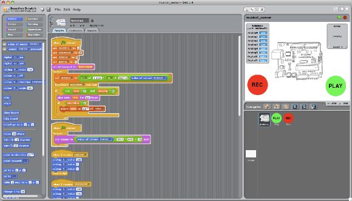
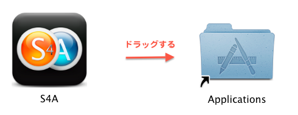
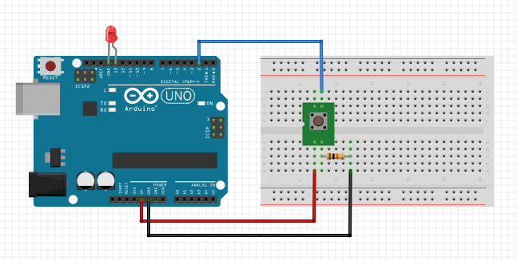
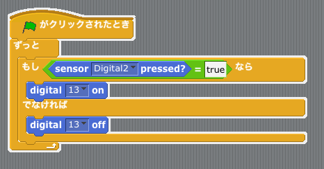
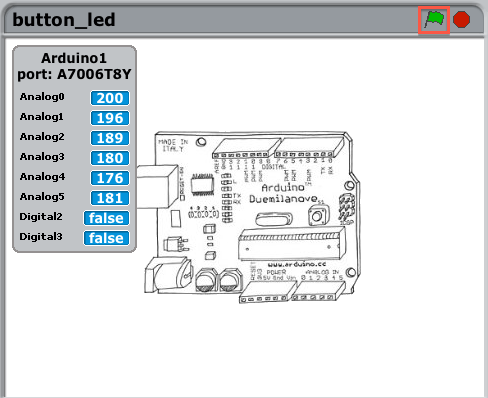
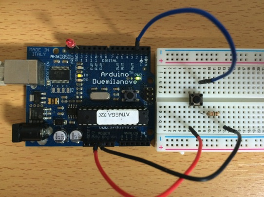
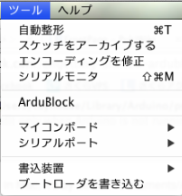
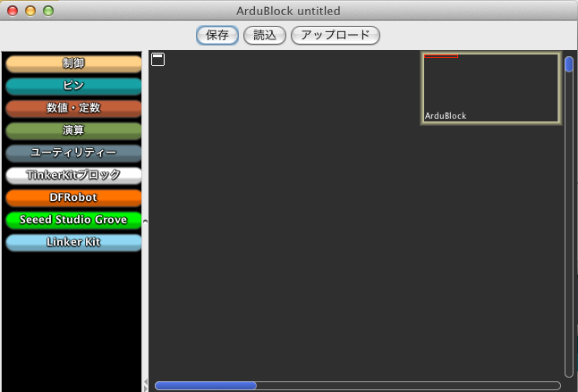
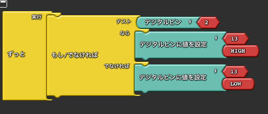

オリジナルの作成：2015/06/06

# C0-子供のためのArduinoその１
## Scratch
Scratchは、子供でもプログラムを楽しめるプログラム言語です。MITのメディアラボで開発されました。

TEDで行われたScratchの紹介です。

- http://www.ted.com/talks/mitch_resnick_let_s_teach_kids_to_code?language=ja

今回は、ArduinoでScratch風のプログラムを体験できる以下の２つのフリーソフトを紹介します。

- S4A:
- AduBlock:

## S4A
S4AはScratchの派生で、Arduinoのプログラムが簡単にできるようにしたものです。

- http://s4a.cat/

### S4Aのインストール
以下にMacとWindowsのダウンロードリンクを示します。

- [Windows](http://vps34736.ovh.net/S4A/S4A16.zip)
- [Mac](http://vps34736.ovh.net/S4A/S4A16.dmg)

S4Aをアプリケーションフォルダーにコピーします。 Macの場合には、S4A16.dmgをダブルクリックし、S4AアイコンをApplicationsフォルダーにドラッグします。

S4Aを動かすには、Arduinoにファームウェアと呼ばれるソフトのインストールが必要です。 以下のZIPファイルをダウンロードし、展開してArduinoのプロジェクトファイルが あるディレクトリ（Macなら書類/Arduino）に入れてください。

次にArduino IDEを起動して、S4AFirmware16をお手持ちのArduinoに書き込んでください。

- [S4AFirmware16.zip](data/S4AFirmware16.zip)

### ブレッドボードの配線
Arduinoとブレッドボードで以下の様に配線をします。

タクトスイッチは、足の出ている部分を上下に差します
抵抗は10KΩを使います

### S4Aを起動
S4Aを起動し、button_led.sbを読み込みます。

S4AのサイトのButton and LEDのサンプルコード（button_led.sb）は、SensorのDigitalピン番号が間違っているので、以下のファイルを使ってください。あるいは、手でサンプルスクリプトのように直してください。

- [button_led.sb](data/button_led.sb)

スクリプトタグには、以下の様なスクリプトが表示されます。

次にbutton_ledの枠の緑の旗をクリックするとスクリプトが動き出します。 タクトスイッチを押すとLEDが点灯し、離すとLEDが消えます。 注意深く見るとタクトスイッチを押したときにDigital2がfalseからtrueに変わるのが分かります。

実際にS4Aを動かしているところ

## ArduBlock
S4AはパソコンでS4Aを動かさないとArduinoが動かないのに対して、 ArduBlockは通常のArduinoのスケッチと同様に、Aduino単独で動かすことができます。

最新の1.8.xのArduino IDEではArduBlockは動作しません。Arduino 1.6.4をご使用ください。（2017/11/12）

### ArduBlockのインストール
以下のURLのDOWNLOAD Ardublockをクリックして、ardublock-all-xxxxxx.jarをダウンロードします。

- http://blog.ardublock.com/engetting-started-ardublockzhardublock/

ユーザのスケッチの置き場（Macならユーザの書類/Arduino）にtools/ArduBlockTool/toolのディレクトリを 作成し、そこにardublock-all-xxxxxx.jarを入れます。

次にArduino IDEを起動すると、ツールメニューにArduBlockが追加されています。

次にArduBLockを選択すると以下の様な画面になります。

S4Aのサンプルと同じ例題をArduBlockで作った例arduBlk_Button_LED.abpを読み込みます。

- [arduBlk_Button_LED.abp](data/arduBlk_Button_LED.abp)

以下の様なスクリプトが表示されます。

次に「アップロード」ボタンを押すと、スクリプトがArduinoに書き込まれます。 個人的には、S4AよりもArduBlockの方が簡単だと思います。
