オリジナルの作成：2015/06/14

ArduBlockのインストール方法は、Arduino勉強会/C0-子供のためのArduinoその１を参照してください。

最新の1.8.xのArduino IDEではArduBlockは動作しません。Arduino 1.6.4をご使用ください。（2017/11/12）

# C1-ArduBlockをはじめよう
## LEDチカチカ
電子工作の定番は、なんと言ってもLEDを点滅させるLチカです。 ArduBlockを使ってLEDチカチカを作ってみましょう。

### スケッチの作り方
Arduino IDEを起動して、ツールメニューからArduBlockを選択すると以下の画面がでます。 左のパネルには、スケッチに使う部品のボタンがあり、右の広いパネルにスケッチを描いていきます。

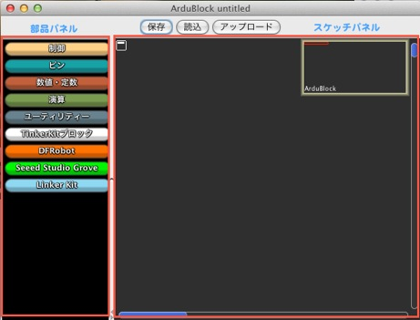

最初に制御ボタンをクリックして、以下のように制御部品の一覧が表示されますので、 「ずっと　実行」をスケッチパネルまでドラッグします。 部品を間違えたときには、部品パネルにドラッグすると消えます。

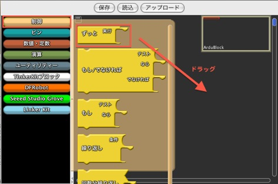

「ずっと　実行」は、その中の処理をずっと繰り返す部品です。 以下の様に左上に配置します。

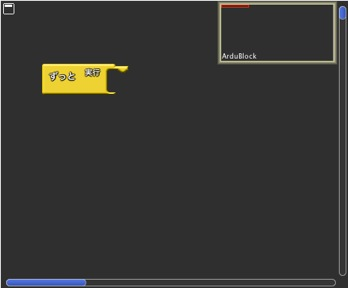

次に、ピンボタンをクリックして、「デジタルピンに値を設定」をスケッチパネルにドラッグし、

「ずっと　実行」の右端にもっていくと、カチッと音がして「デジタルピンに値を設定」が 「ずっと　実行」の中にセットされます。

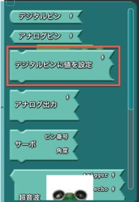

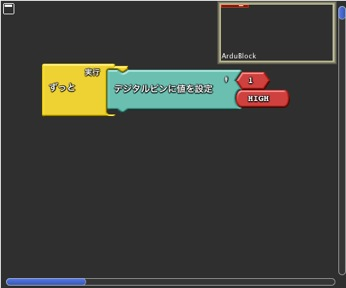

次にユーティリティーボタンをクリックして、「待つ　ミリ秒」部品をドラッグし、 先ほどの「デジタルピンに値を設定」の下にドラッグするとまたカチッと音がして、 「ずっと　実行」の中にはセットされます。

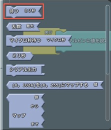

「デジタルピンに値を設定」、「待つ　ミリ秒」をもう1回ずつセットしると、

以下の様になります。ここで、最初の「デジタルピンに値を設定」の#の右となりの番号を13に変更し、 2個目のデジタルピンに値を設定」の番号も13に変更し、HIGHからLOWに変更します。

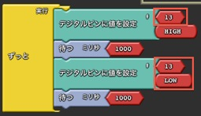

ここまでできたら、保存ボタンをクリックしてスケッチを「LEDチカチカ」という名前で保存します。

### 動かしてみる
できたスケッチをArduinoに書き込むには、アップロードボタンをクリックします。 注意深くみているとArduinoのTXとRXのLEDがすばやく点滅したあとにその上のLEDが1秒間隔で チカチカ点滅します。

## スイッチを使う
こちらは、Arduino勉強会/C0-子供のためのArduinoその１を参照してください。

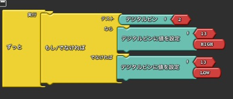

## 電圧を測る
電圧を測るには、アナログ入力を使います。アナログ入力には、A0からA5の6個のピンが使えます。

### ブレッドボードの配線
電圧を変えるために、10KΩの半固定抵抗を使います。 スイッチサイエンスからブレッドボードにそのままささる、 つまみの大きい半固定抵抗 10KΩ が販売されているので、1個あると便利です。

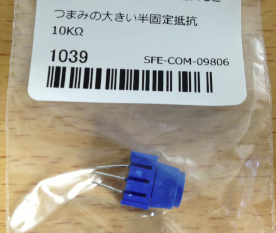

以下のようにブレッドボードに10KΩの半固定抵抗を差して、線を結びます。

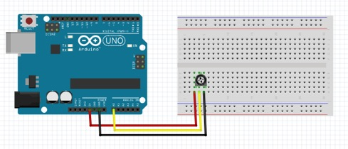

### スケッチを描く
以下の手順でスケッチを描いていきます。

- 「制御」ボタンから「ずっと　実行」をドラッグ
- 「ユーティリティー」ボタンから「シリアル出力」をドラッグ
- 「数値・定数」ボタンから「メッセージ」をドラッグ
- 「数値・定数」ボタンから「真偽値を文字列に」をドラッグ
- 「ピン」から「アナログピン」をドラッグ

値を変更する箇所は、以下の通りです。

- メッセージをSensor =に変更
- アナログピンの#の番号を1から0に変更

以下のようなスケッチが完成したら保存ボタンで「電圧を測る」の名前で保存します。

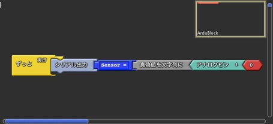

### 動かしてみる
アップロードボタンをクリックしてスケッチをArduinoに書き込みます。

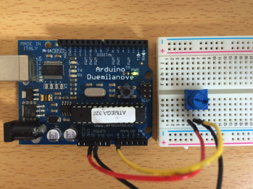

Arduino IDEのツールメニューからシリアルモニタを選択すると、電圧の値が0から1023の間の値で表示されます。

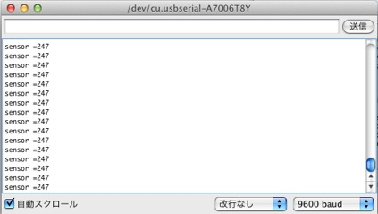

## 距離を測る
秋月で400円で買える、超音波距離センサ HC-SR04 を使って、距離を測ってみましょう。

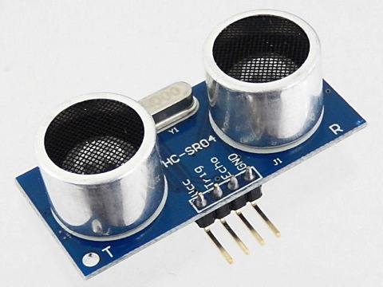

### ブレッドボードの配線
以下のようにブレッドボードにHC-SR04を差して、線を結びます。

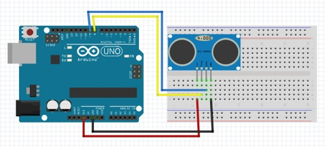

### スケッチを描く
以下の手順でスケッチを描いていきます。

- 「制御」ボタンから「ずっと　実行」をドラッグ
- 「ユーティリティー」ボタンから「シリアル出力」をドラッグ
- 「数値・定数」ボタンから「メッセージ」をドラッグ
- 「数値・定数」ボタンから「真偽値を文字列に」をドラッグ
- n「ピン」ボタンからから「超音波」をドラッグ
- 「ユーティリティー」ボタンから「待つ　ミリ秒」をドラッグ

値を変更する箇所は、以下の通りです。

- メッセージをDistance =に変更
- 超音波のTrigger #を8、echo #を9に変更
- 待つ ミリ秒を500に変更

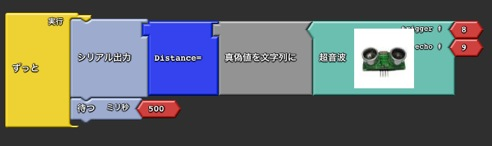

### 動かしてみる
アップロードボタンをクリックしてスケッチをArduinoに書き込みます。

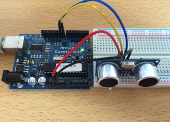

Arduino IDEのツールメニューからシリアルモニタを選択すると、超音波センサからの距離がcm単位で表示されます。

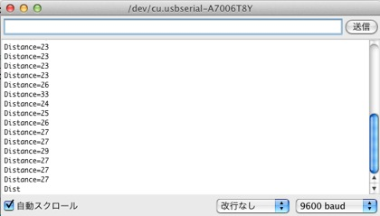

## サーボモータをまわす
サーボのテストには秋月で400円で買えるマイクロサーボ9gを使います。 ちょっとした工作に便利な一品です。

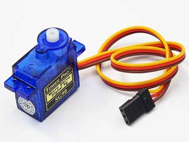

### ブレッドボードの配線
以下のようにブレッドボードに半固定抵抗を差して、マイクロサーボと線で結びます。

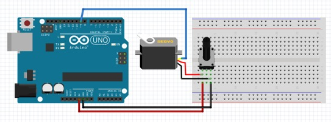

### スケッチを描く
以下の手順でスケッチを描いていきます。

- 「制御」ボタンから「ずっと　実行」をドラッグ
- 「ピン」ボタンからから「サーボ」をドラッグ
- 「ユーティリティー」ボタンから「マップ」をドラッグ
- 「ピン」ボタンからから「アナログピン」をドラッグ
- 「ユーティリティー」ボタンから「待つ　ミリ秒」をドラッグ

値を変更する箇所は、以下の通りです。

- サーボのピン番号を9に変更
- アナログピン#を0に変更
- マップのまでを255から179に変更
- 待つ ミリ秒を100に変更

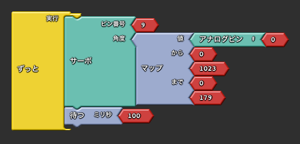

### 動かしてみる
アップロードボタンをクリックしてスケッチをArduinoに書き込みます。

半固定抵抗のつまみを回すとサーボの方向が変わります。

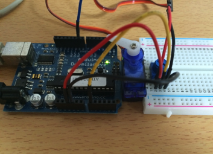
