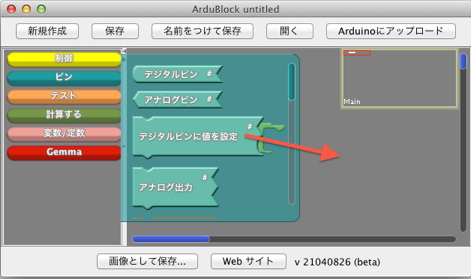
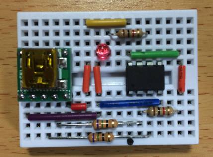
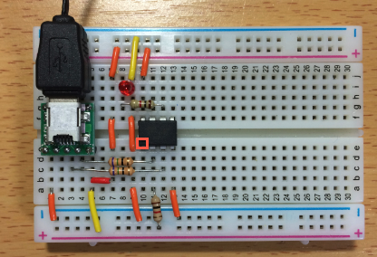
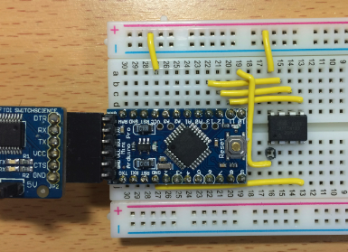
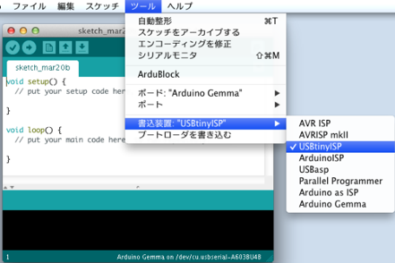
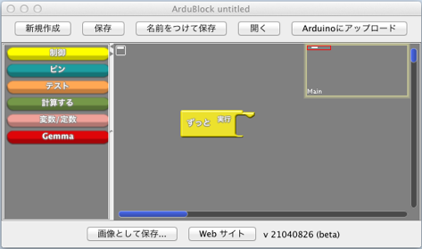
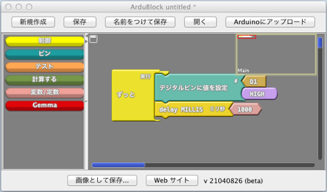
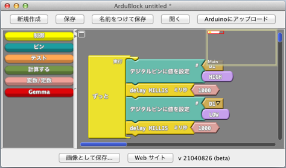

オリジナルの作成：2016/03/20

# C2-ワンコインArduinoのArdublockでLチカ
## Ardublockとは
MITメディアラボで開発されたプログラム言語Scratchライクな開発環境を Arduinoでも使えるようにしたのが、Ardublockです。

以下の様にマウスでブロックを並べてプログラムを描くので、 小さなお子さんでも簡単にスケッチ （Arduinoではプログラムをこう呼びます） を描くことができます。



## ワンコインArduino（lbedGemma）を組み立てる
小学生でも楽しめるようにワンコイン（500円程度）で体験できるArduino をブレッドボーで作ってみましょう。

** ワンコインArduinoは、trinketloaderのブートローダーをしているため、個人で利用するのは問題ありませんが、このブートローダを商品に利用することはできませんので、ご注意ください。 **

Arduino勉強会/16-ワンコイン・マイコンlbedGemma ではじめて作ったワンコインArduinoから少し改良して、２つのタイプのワンコインArduinoを用意しました。

スケッチの書き込み用に作成したGemmaライター版



初代のワンコインArduinoと同様にブレッドボードで様々な実験をする実験版 



製作で注意する点は、USBミニコネクターにつながっている抵抗が75Ω（紫、緑、黒、金）で、 残り2本の抵抗が1kΩ（茶、黒、赤、金）です。LEDは長い線が抵抗と同じ列の穴に差してください。 マイコンは、●のくぼみ（赤の矩形で囲んだところ）がある場所が1番ピンで左下に位置するように差してください。

### 部品表
すべての部品は、 秋月 から購入できます。以下は実験版の部品一覧です。

 | 部品名	 | 数量	 | 通販コード	 | 価格	 | 備考 | 
 |---|---|---|---|---|
 | ATtiny85	 | 1	 | I-09573	 | 160円	 |  | 
 | ブレッドボード BB-801	 | 1	 | P-05294	 | 200円	 | P-00315でもよい | 
 | ミニＢメスＵＳＢコネクタ	 | 1	 | K-05258	 | 200円	 |  | 
 | 赤色ＬＥＤ	 | 1	 | I-00562	 | 350円	 | 100個入り | 
 | 抵抗 75Ω	 | 2	 | R-25750	 | 100円	 | 100個入り | 
 | 抵抗 1KΩ	 | 2	 | R-25102	 | 100円	 | 100個入り | 
 | ジャンパーワイヤセット	 | 1	 | P-00288	 | 400円	 | 単線ワイヤーでも可 | 


## Arduino IDE
現時点（2016/03/20）での最新のArduino IDEは1.6.8ですが、 ワンコインArduinoが正常に動作すると確認されている1.6.4をインストールします。

### Mac OSXのインストール方法
以下のURLから1.6.4版のMAC OS Xをダウンロードしてください。

- https://www.arduino.cc/en/Main/OldSoftwareReleases#previous

ダウンロードしたZIPファイルを解凍し、Applicationフォルダにコピーしてください。

### Windows XPのArduino IDEのインストール方法
以下のURLから1.6.4版のWindows Installerをインストールしてください。

- https://www.arduino.cc/en/Main/OldSoftwareReleases#previous

ダウンロードしたarduino-1.6.4-windows.exeを実行するとインストールが実行されます。 指示に従ってインストールしてください。

### Usbtinyのドライバーのインストール方法
Windowsの場合、Arduino IDEの他にUsbtinyのドライバーも合わせてインストールします。

usbtiny_signed_8.zipを解凍し、XPの場合installer_x86.exeを実行します。 64bitのCPUの場合には、installer_x64.exeを実行してください。

GemmaをWindowsに接続すると「新しいハードTrinketを検出しました」とでるので、 ドライバーの場所を解凍したディレクトリにセットして、インストールします。

### Adafruit Gemmaのブートローダーの書き込み
Adafruit Gemmaのブートローダーの書き込みには、別のArduino（ここではArduino Pro Mini 5V版）を使います。 

別のArduinoとATtiny85との接続は、以下の様にします。

 | ATtiny85	 | Arduino | 
 |---|---|
 | 8番ピン VCC	 | 5V | 
 | 4番ピン GND	 | GND | 
 | 1番ピン Reset	 | 10番ピン | 
 | 5番ピン PB0	 | 11番ピン | 
 | 6番ピン PB1	 | 12番ピン | 
 | 7番ピン PB2	 | 13番ピン | 
 
ATtiny85のピンの説明をデータシートから引用します。


Adafruit Gemmaのブートローダは、以下のURLで公開されていますので、これをArduinoに書き込みます。

- https://learn.adafruit.com/introducing-trinket/repairing-bootloader

シリアルモニターを開き9600 baudにセットし、以下のメッセージが出力されたら、「G」を入力します。

```
Trinket loader!

Type 'G' or hit BUTTON for next chip
```

書き込みの途中で以下の様なメッセージが出力されます。

```
Starting Program Mode [OK]

Reading signature:930B
Searching for image...
  Found "blankfull.hex" for attiny85

Setting fuses  Set Low Fuse to: F1 -> A000  Set High Fuse to: D5 -> A800  Set Ext Fuse to: 6 -> A400
Verifying fuses...
Low Fuse: 0xF1 is 0xF1
High Fuse: 0xD5 is 0xD5
Ext Fuse: 0x6 is 0x6


Setting fuses

Verifing flash...
Flash verified correctly!
Verifying fuses...

Fuses verified correctly!
*OK!*
```



勉強会に参加された方には、その場でATtiny85にブートローダーを書き込んでいただきます。

## Ardublockのインストール
本家のArdublockのサイトでは、ATtiny85用のArdublockが提供されていないため、 公開されているソースに追加し、ワンコインArduino用のArdublockを作成しました。

以下のリンクをクリックするか、Facebookの「工作プロジェクト」からダウンロードし、Arduinoのファイルが保存されているフォルダ（Mac OSXだと文書の下のArduinoフォルダ、Windowsだとマイドキュメントの下のArduinoフォルダ）のtoolsフォルダ*4に入れてください。

- &ref(): File not found: "ArduBlockTool.zip" at page "Arduino勉強会/C2-ワンコインArduinoのArdublockでLチカ";
- 工作プロジェクトのArdublockファイル

## ArdublockでLチカを作ってみよう
Lチカというのは、LEDをチカチカさせることで、Arduinoやマイコンを使った電子工作で最初に作るプログラムです。

### Arduino IDEの設定
それでは、インストールが完了したArduino IDEを起動しましょう。Arduinoのアイコンをダブルクリックします。

以下の様なsetupとloopが定義されたスケッチが表示されます。

ツールメニューで以下の項目を設定します。

- ツール>ボード>Arduino Gemma
- ツール>書込装置>USBtinyISP



まずは、確認のために以下のスケッチをコピーして、ファイルメニューから名前を付けて保存を選択し、Gemma_Blinkとしてください。

```C++
int led = 1;

void setup() {                
  pinMode(led, OUTPUT);     
}

void loop() {
  digitalWrite(led, HIGH);   // turn the LED on (HIGH is the voltage level)
  delay(1000);               // wait for a second
  digitalWrite(led, LOW);    // turn the LED off by making the voltage LOW
  delay(1000);               // wait for a second
}
```

ワンコインArduinoのUSBケーブルをパソコンに接続すると赤のLEDが10秒間明るくなったり、暗くなったりします。 この間に、ファイルメニューから書込装置を使って書き込むを選択します。

成功すると「マイコンボードへの書き込みが完了しました。」と表示され、LEDが1秒間隔に点滅します。

### Ardublockを開いてみる
Ardublockで作られたスケッチを保存するため、ファイルの「新規ファイル」を選択し、 ファイルメニューから「名前を付けて保存」を選択し、AruduBlock_Workの名前で保存します。

ツールメニューからArbuBlockを選択すると、以下の様な画面が表示されます。



左側に色んなツールが並び、画面中央（スケッチ画面）に「ずっと　実行」のパネルがあります。

「ピン」のツールをクリックし、「デジタルピン」をスケッチ画面にドラックします。


これを「ずっと　実行」の中に入れます。 次に「制御」から「delay MILLIS ミリ秒」を同様にスケッチ画面にドラッグします。



これを繰り返します。2回目のデジタルピンに値を設定の右下のHIGHをLOWに変更すると以下の様になります。



これでスケッチは完成です。「名前をつけて保存」ボタンを押してBlinkという名前で保存します。

### スケッチを動かしてみる
ワンコインArduinoのUSBケーブルをパソコンに接続し、「Arduinoにアップロード」を押します。

ArduBlock_Workの画面にArduinoのスケッチが生成され、ワンコインArduinoに書き込まれ、LEDが点滅します。

試しに、「delay MILLIS ミリ秒」の1000の値を555に変えて、もう一度USBケーブルを接続し直して、 「Arduinoにアップロード」を押して見てください。点滅が速くなっています。
