オリジナルの作成：2016/03/26

[「8pino」ではじめるミニマム電子工作 ](https://www.kohgakusha.co.jp/books/detail/978-4-7775-1915-6)
（以下ミニマム本と書きます）に触発されて、ブレッドボードで作るATtiny85を使ったワンコインArduinoで 電子工作を楽しんでみました。

例題の多くは、ミニマム本を参考にさせて頂き、これをScratch風のArdublockを使ってスケッチを作りました。

このコーナーに進む前に、ワンコインArduinoの基本について Arduino勉強会/C2-ワンコインArduinoのArdublockでLチカ を参考にしてください。

# C3-ワンコインArduinoのArdublockで遊ぶ
## デジタル入力
最初の工作は、タクトスイッチを使ったスイッチのオン・オフをとらえて、LEDを点滅してみましょう。

デジタルの入力は、０と１のみで、スケッチではLOW, HIGHとして表現しています。

### 部品
スイッチ回路に必要な部品は、以下の４つです。

- タクトスイッチ　1個
- 抵抗（茶黒赤金）10KΩ　1本
- 青のジャンパー線　1本
- オレンジのジャンパー線　1本

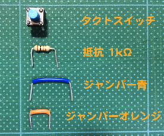

### プルアップ抵抗を使ったスイッチ回路
それでは、以下のような抵抗を電池のプラス側につないだスイッチ回路を作ってみましょう。

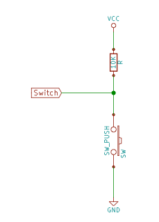

VCCは、電池のプラスを表し、USBからの5Vに相当します。VCCに10KΩの抵抗をつなぎ、その下にタクトスイッチの左側のピンにつなぎ、右側のピンをGNDにつなぎます。途中Switch（7番ピン#2）というピンがタクトスイッチと抵抗の間につながれています。

ブレッドボードで部品を以下の様につないでください。

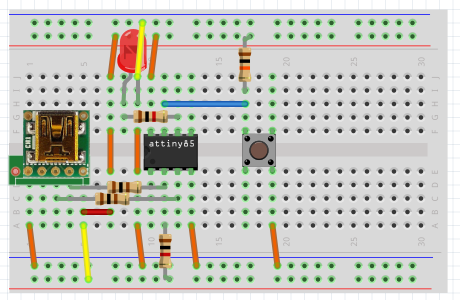

### スケッチを描く
それでは、Ardublockを使って以下のようにスケッチを描いてください。

- [SwitchButton-PullUp.abp](data/SwitchButton-PullUp.abp)

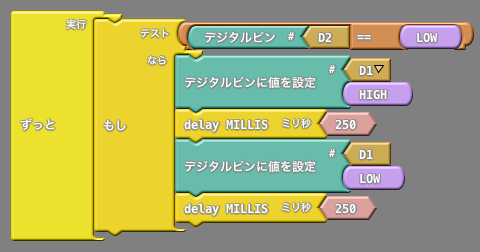

### 動かしてみる
スケッチが完成したら、USBケーブルをPCに接続し、「Arduinoにアップロード」ボタンを押して、 ワンコインArduinoにスケッチを書き込みます（Arduinoでは、これをアップロードと言います）。

タクトスイッチを押すとLEDが短く点滅し、離すとLEDが消えます。

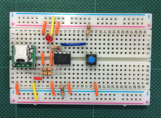

### スイッチの電圧を測ってみる
スイッチを離しているときのスイッチの両端の電圧をテスターで測ってみましょう。

VCCからわずかの電流がマイコンに流れ込み、USBの電圧（この時4.73V）がわずかに下がり4.72Vであり、 デジタル入力は、1のHIGHとなります。

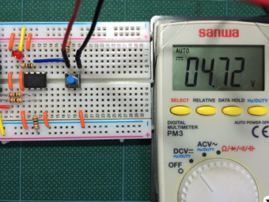

スイッチを押すとSwitchのピンの電圧はGNDと同じになるので0Vとなり、 デジタル入力は、0のLOWとなります。この時スケッチの「もし」の条件が成り立ち、 LEDを短く点滅させます。

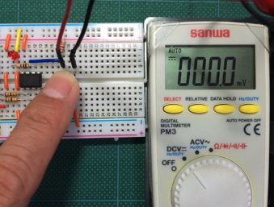

## アナログ出力（ＰＷＭ）
Arduinoでは電圧を変えるアナログ出力機能はありません。その代わりに一定の周期のパルス幅の割合（デューティ比） を変えるパルス幅変調方式を使ってアナログ出力を行っています。

Wikiの
[デューティ比](https://ja.wikipedia.org/wiki/%E3%83%87%E3%83%A5%E3%83%BC%E3%83%86%E3%82%A3%E6%AF%94)
からデューティ比の説明図を引用します。

デューティ比が大きいと電圧が掛かっている時間が長く、 デューティ比が小さいと電圧が掛かっている時間が短くなります。 これで、LEDやモータに流れる電流の量を調整することで、明るさや回転の強さをコントロールします。 また、抵抗とコンデンサーを使った低周波フィルターを通すとデューティ比の変化が波の形で出力します。

### 部品
アナログ出力回路に必要な部品は、以下の２つです。

- LED　1個
- 抵抗（黄紫茶金）470Ω　1本

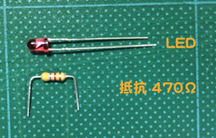

### 回路
アナログ出力回路は、以下の様にします。 抵抗はLEDにたくさんの電流が流れないようするために、つなぎます。

ブレッドボードで部品を以下の様につないでください。 LEDの線の長い方*1をマイコンの5番ピンに、LEDの線の短い方*2を抵抗につなぎます。

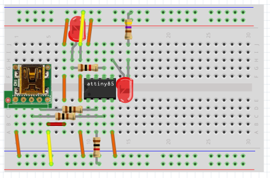

### スケッチを描く
Ardublockを使ってアナログ出力のスケッチを描いてみましょう。

- [PWMOut.abp](data/PWMOut.abp)

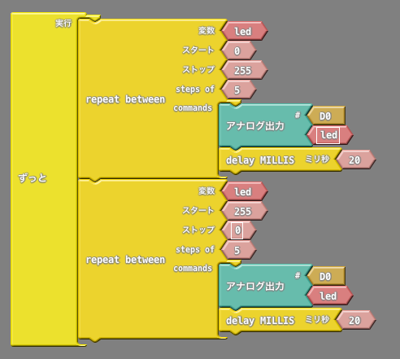

以下の手順でスケッチを描いて下さい。

- 「制御」から「repeat between」部品をドラッグし、「ずっと」入れます

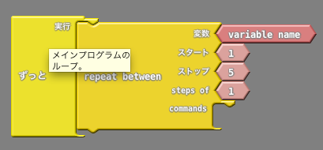

- 変数をled、スタートを0、ストップを255、steps ofを5に変更します
- 「ピン」からアナログ出力をドラッグし、repeat betweenのcommandsに入れます

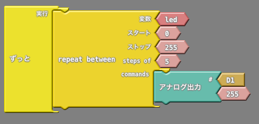

- #をD0に、255を外してゴミ箱に入れます
- 「repeat between」の変数ledを右クリックして、複製を選択します

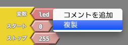

- 複製されたledを「アナログ出力」の空いたところに入れます

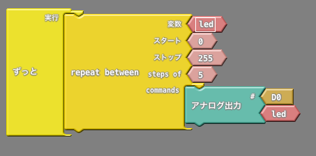

「制御」から「delay MILLIS」をドラッグし、「アナログ出力」の下に入れ、ミリ秒の値を20に変えます

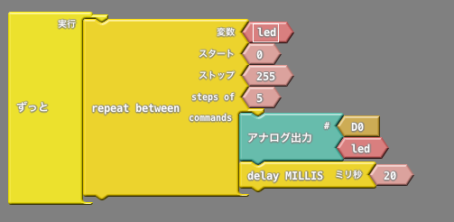

- これまでの処理を繰り返し、もう一つ「repeat between」を「ずっと」に入れ、スタートが255、ストップが0にします

### 動かしてみる
スケッチが完成したら、 「名前をつけて保存」を押して、PWMOutと名前を入力して保存します。 次に、USBケーブルをPCに接続し、「Arduinoにアップロード」ボタンを押して、 ワンコインArduinoにスケッチを書き込みます。

LEDが少しずつ明るくなったり、暗くなったりを繰り返します。

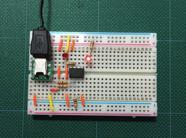
