オリジナルの作成：2015/10/17

# J0-Arduinoで実験（トラ技201510）
## LEDイルミネーション
トランジスタ技術2015年10月号（トラ技2015/10と書きます）で紹介されている 「手を叩くと光り出すフルディスクリートLEDイルミネーション」 を作ってみました。

部品もCQ出版で購入できるので、地方に住む私でも簡単に実験ができました。

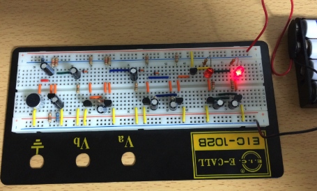

実際に動かしている動画が以下に公開しています。

- https://www.facebook.com/hiroshi.takemoto.94/videos/877183202388707/?l=4810678554336115820

### 回路
全体の回路をトラ技2015/10の図２から引用します。

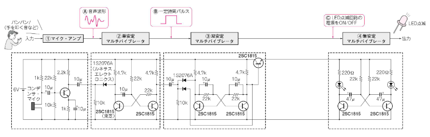

### トランジスタの基礎
トラ技2015/10の特集記事はとても良くできていて、回路の抵抗値がどのようにして 計算されたのか実験とLTSpiceを使ったシミュレーションで丁寧に説明しています。

基本は、以下の３つです。

- ベース・エミッタ間の電圧: $V_{BE}$ = 0.6 〜0.8 V（計算では0.6Vで計算しています）
- トランジスタの電流増幅は: Ic = β Ib（通常β=100で計算します）
- オームの法則: V = R I

これまで、何の疑問もなく$V_{BE}$は0.6と覚えていましたが、 0.6V近辺で頭打ちになる性質を使って、電圧の計算がとても簡単にできることを再確認しました。

トランジスタの$V_{BE}$を測る回路をトラ技の図7から引用します。

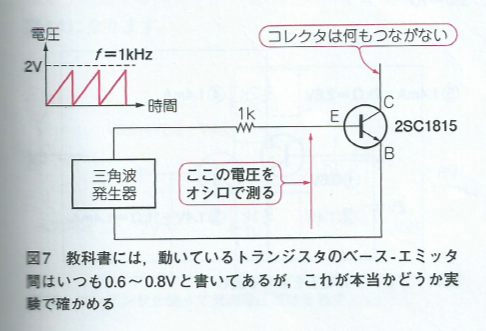

この回路をブレッドボードに以下の様に組み立て、Arduinoのオシロスコープと Arduinoを使ったノコギリ波で試してみました。

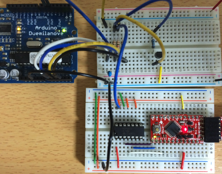

[08-オシロスコープ](https://nbviewer.jupyter.org/github/take-pwave/letsArduino/blob/master/08-Oscilloscope_with_Arduino.ipynb)
を使ってみるで紹介したArduinoのオシロスコープで、 ノコギリ波とVBEを測ってみました。電圧は１メモリ1V、横軸の時間は１メモリ10m秒です。

上段のノコギリ波は、2.5Vまで直線上に上昇していますが、 下段のVBEは、0.7V近辺で横ばいになっています。

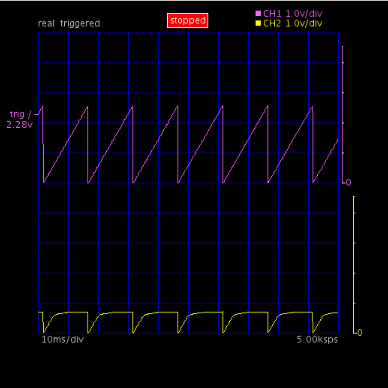

このようにArduinoオシロスコープを使うと簡単にトランジスタの実験が できます。

### マイク・アンプ回路
マイク・アンプの回路を図2から抜粋します。

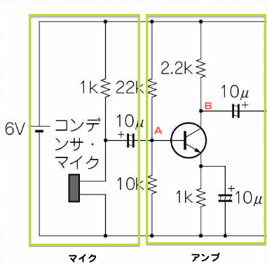

マイクの回路（左の緑の矩形）は、データシートを元にされたと記事にありました。 *2

右の矩形がアンプで、 電子工作/もう一度トランジスタでも紹介したエミッタフォロワーの増幅回路です。

これをブレッドボードで実装しました。

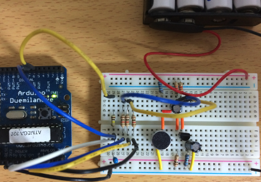

Arduinoのオシロスコープで手を叩いたときのA点とB点の波形を取り込んでみました。

上がA点で1メモリが0.5V、下がB点で1メモリが2.0Vで、 時間軸は1メモリ10m秒で表示しています。

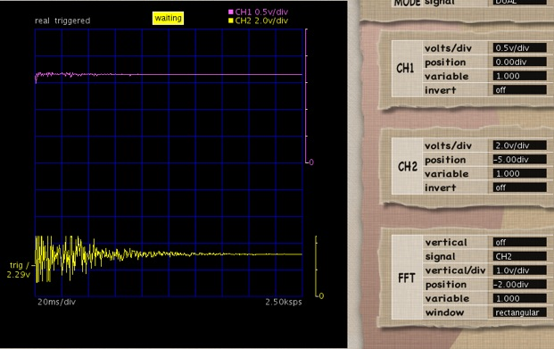

CQ出版からダウンロードしたファイルに付属していた、LTSpiceのモデルを使ってアンプの増幅を計算してみました。

以下の回路で、シミュレーションを実施しました。

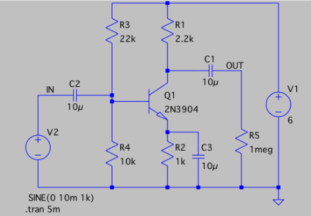

VinとVoutは、以下の様に計算され、Arduinoのオシロスコープで測定されたのと同様の増幅がみられました。

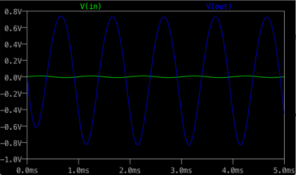

## 双安定マルチバイブレータ
双安定マルチバイブレータにスイッチ付けた回路をブレッドボードに組みました。

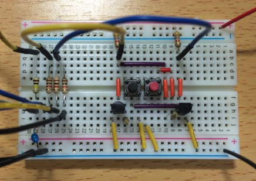

Arduinoのオシロスコープで黒と赤のスイッチで反転している様子が確認できました。 *3

これは、デジタルのフリップフロップ回路と同じ動作をしています。

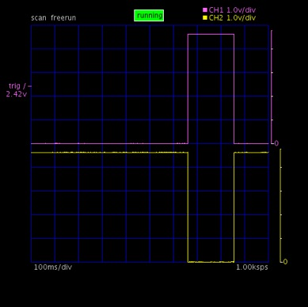

これを以下のLTspiceのモデル*4で シミュレーションしてみました。

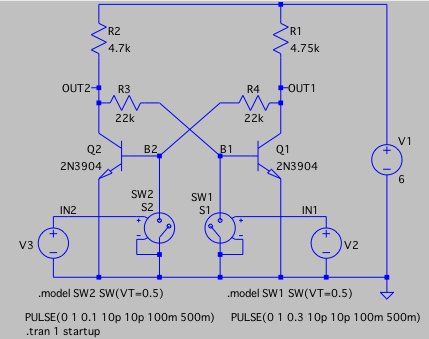

Arduinoオシロスコープの測定範囲が0.0〜5.0Vのため、以下の様なマイナスのひげは みることができませんでした。

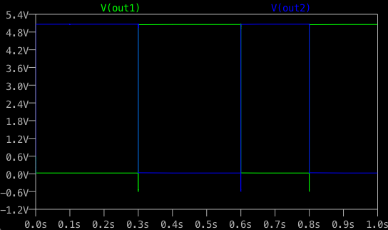

## 無安定マルチバイブレータ †
最後に、無安定マルチバイブレータの出力波形（OUT1, OUT2）をArduinoオシロスコープでみてみます。

一方が0Vになった瞬間からコンデンサーに電荷が蓄えられる様子が確認できます。

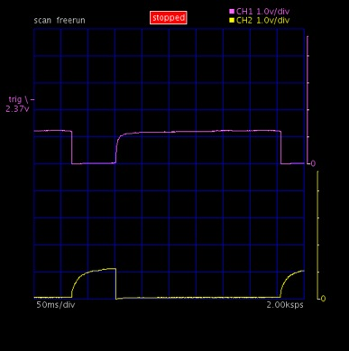

### LTspiceのシミュレーション
LTspiceで以下の無安定マルチバイブレータ回路をシミュレーションします。

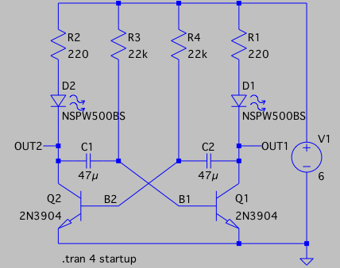

シミュレーションの出力は以下の様になります。

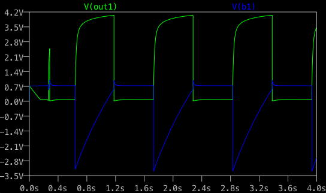

Arduinoオシロスコープの出力は、以下の様になっています。

Arduinoオシロスコープの測定範囲が0.0〜5.0Vのため、０Vからの出力になっていますが、

同様の波形が見られます。

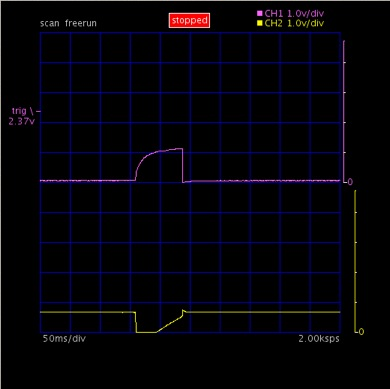

とても簡単に作れるArduinoオシロスコープでも、トランジスタの実験には 十分使えることが分かりました。
