オリジナルの作成：2016/02/07

# J1-ディスクリート555を試す
## ディスクリート555の作成
トラ技2016/01で紹介されたタイマーIC NE555をトランジスタで再現したディスクリート555を作ってみました。

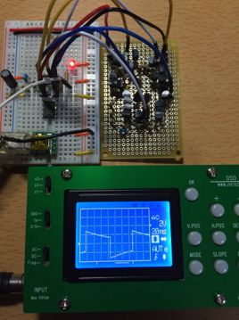

### ディスクリート555の回路
トラ技の図３からディスクリート555の回路を引用します。

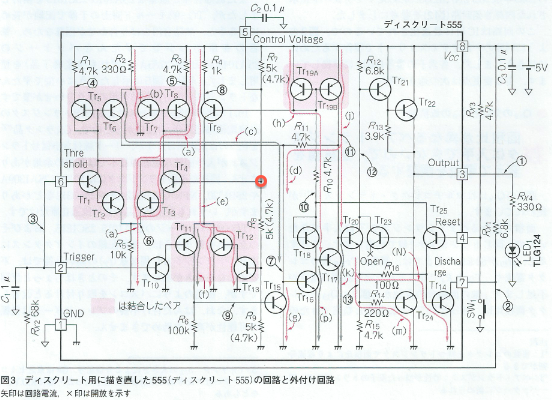

ユニバーサル基板のパターンも図８より引用します。トランジスタの赤線はPNPの2SA1015で、 黒線がNPNの2SC1815です。 *1

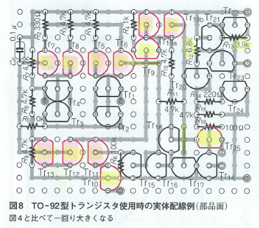

このパターンをいつものようにテクノペンで回路を書いて作成しました。 

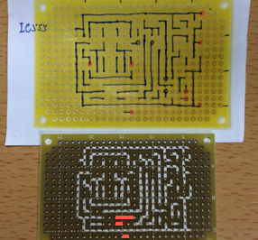

## 動作確認
ディスクリート555テをストをする前に、オリジナルのNE555を使ってLEDの点滅回路をブレッドボードで動かしました。 以下のサイトを参考にさせて頂きました。

- http://www.rlc.gr.jp/prototype/hashin/n555/n555.htm

抵抗とコンデンサーの値は、以下の様に設定しました。

- RA: 1KΩ
- RB: 10KΩ
- C: 10μF

T1とT2の周期は、以下の様になります。（データシートのASTABLE OPERATION）

- T1 = 0.693 (RA+RB)・C = 76m秒
- T2 = 0.693 RB・C = 69m秒

### ArduinoオシロスコープKti-Scopeを使ってNE555の波形をみる
Arduinoオシロスコープ（Kit-Scope）専用のArduinoとして、ちっちゃいものくらぶYahoo店の600円の Arduino Nano3.0 互換ボード を使いました。

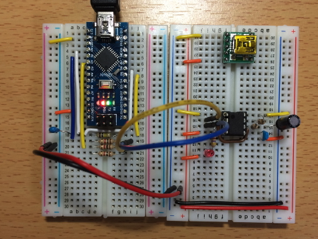

回路図の①（NE555の3番ピン）と③（NE555の6番ピン）の波形をKit-Scopeでみてみます。 T1の周期波、計算値の69m秒と一致しており、③のチャージと放電の繰り返しも上手く捉えています。

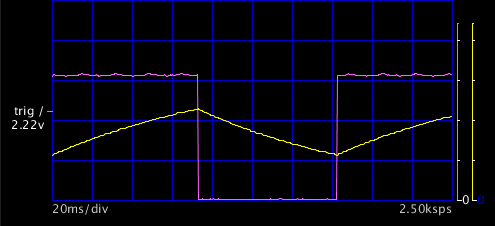

## ディスクリート555の波形をみる
NE555で発振回路の動作が確認できましたので、ディスクリート555の波形をみてみましょう。

機器の接続は、以下の様にしました。

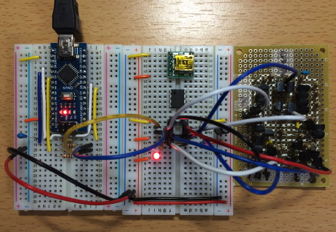

回路図の①（NE555の3番ピン）と③（NE555の6番ピン）の波形をトラ技図１０から引用します。

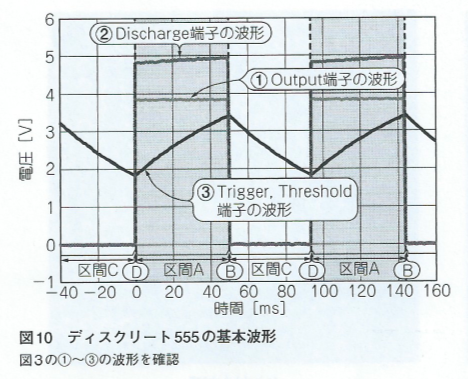

回路図の①（NE555の3番ピン）と②（NE555の7番ピン）のディスクリート555の観測波形を以下に示します。

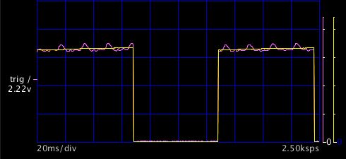

回路図の①（NE555の3番ピン）と③（NE555の6番ピン）のディスクリート555の観測波形を以下に示します。

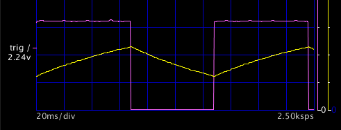

### 回路内部の波形
ディスクリート555を作ったのは、1チップの回路をトランジスタで組み立てる興味と、 回路内部の信号をオシロスコープで観察してみたいという思いからです。

今ならSPICEを使えば、波形は調べられるのでしょうが、計算値と実際に組んだ回路では一致しないこともあります。

まずは上部コンパレータ部の③から⑦までの波形プロットしたトラ技の図１１を引用します。

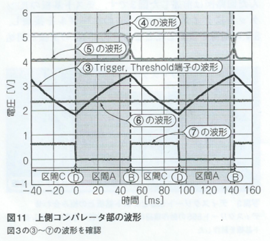

この回路のキモは、抵抗R7とR8+R9でVCCの2/3に分圧した点（図３の赤丸）から２VBE下がった ⑥の電圧が一定となり、③のチャージが進む区間Aの終わりでTr5に電流が流れ始め④の電圧が下がって いる様子がはっきり見て取れます。この結果Tr6を経由した電流(c)がTr16をオンにします⑦。

これをディスクリート555でみてみましょう。 赤線で③（NE555の6番ピン）を一緒に表示して位置関係が分かるようにしました。

④の波形は、以下の様になります。区間Aの終わりで下がります。

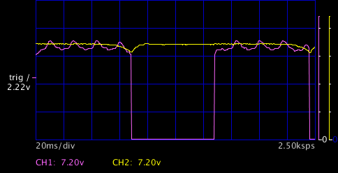

これとは対照的⑤の波形はTr8を流れる電流が減少するため、上昇します。

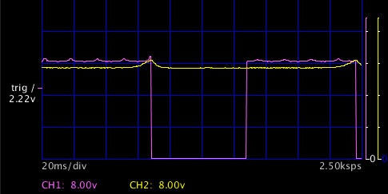

確認のため、電圧が一定であるはずの⑥をプロットします。

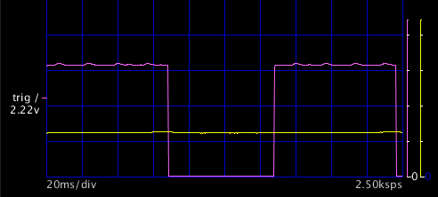

Tr16に流れる電流がフリップフロップのリセットとして機能します。 ⑦を見ると④の下降に合わせて電圧が上昇しています。

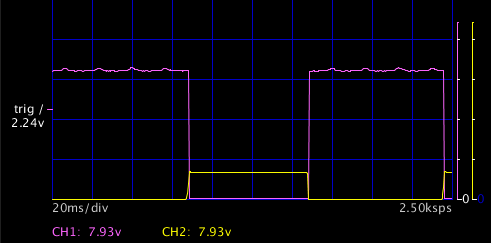

### 下部コンパレータ部
下部のコンパレータは、(R7+R8)とR9で分圧されたVCCの1/3点（1.1V）であり、Tr12のエミッタ 電圧は２VBE上がった2.3Vを保ちます。

⑧の波形は、以下の様に一定になっています。

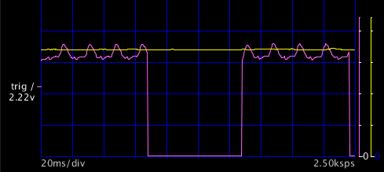

これに対して⑨（ノイズが多い）は、区間Aの終わりで下がり、区間Bの終わりで上がるパターンを示します。

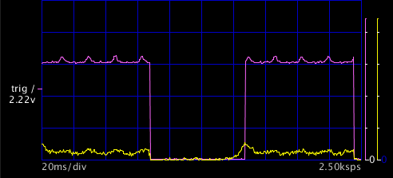

### フリップフロップと出力部
フリップフロップと出力部の波形をプロットしたトラ技の図１３を引用します。

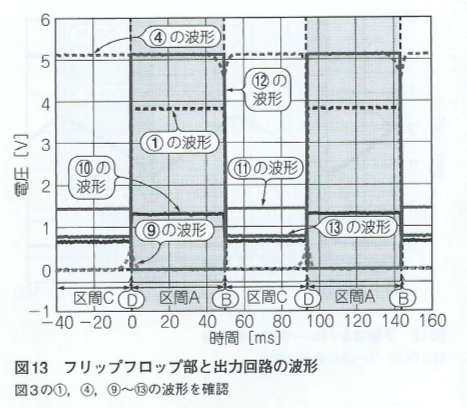

フリップフロップのコアはTr16とTr17であり、⑩と⑪の観測波形を表示してみます。 区間Aの終わりでHighからLowに変わっています。

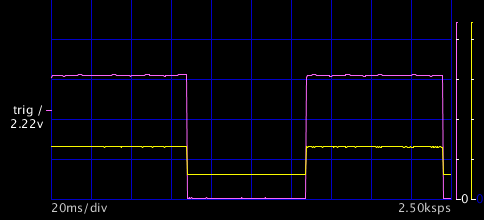

これに対して⑪の波形は、区間AではLow、区間BでHighに変化しています。

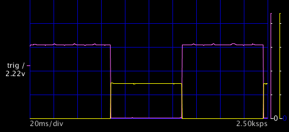

図１３の下部に区間A、B、区間C、Dの4つのタイミングに分けて、状態を整理してみます。

 | 機能	 | トランジスタ	 | 波形	 | A	 | B	 | C	 | D	 | Reset=L	 | 備考 | 
 |---|---|---|---|---|---|---|---|---|
 | リセット	 | Tr6	 | ④	 | OFF	 | ON	 | OFF	 | OFF	 | OFF	 | 流れると電圧が下がる | 
 | セット	 | Tr15	 | ⑨	 | OFF	 | OFF	 | OFF	 | ON	 | ON	 | 区間Aのレベルは、0.6Vを超えない | 
 | フリップフロップ	 | Tr16	 | ⑦	 | OFF	 | ON	 | ON	 | OFF	 | OFF	 |  | 
 | フリップフロップ	 | Tr17	 | ⑩	 | ON	 | OFF	 | OFF	 | ON	 | OFF	 |  | 
 | 出力	 | Tr20	 | ⑪	 | OFF	 | ON	 | ON	 | OFF	 | ON	 |  | 
 | 出力	 | Tr24	 | ⑬	 | OFF	 | ON	 | ON	 | OFF	 | ON	 |  | 
 | 放電	 | Tr14	 | ⑪	 | OFF	 | ON	 | ON	 | OFF	 | ON	 |  | 
 | 555の出力	 |  | 		 | H	 | L	 | L	 | H	 | L	 |  |  |

