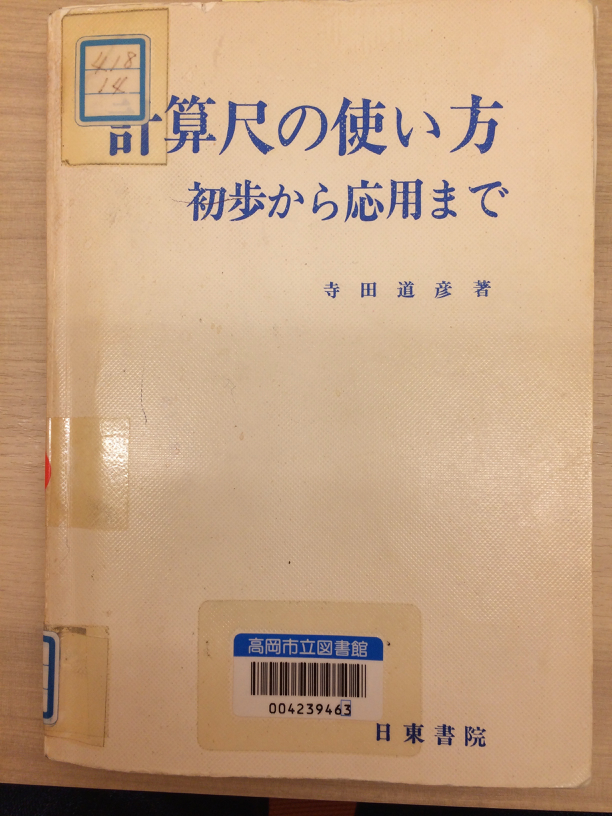
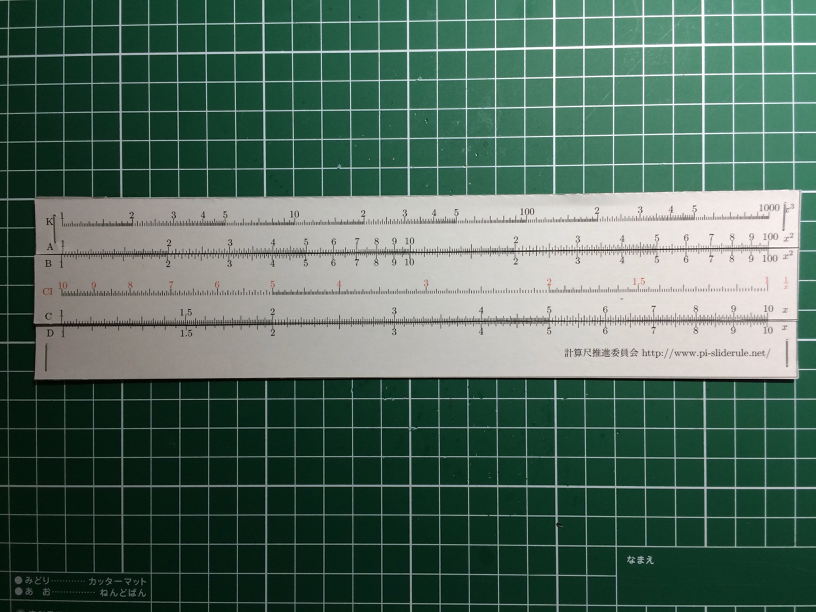
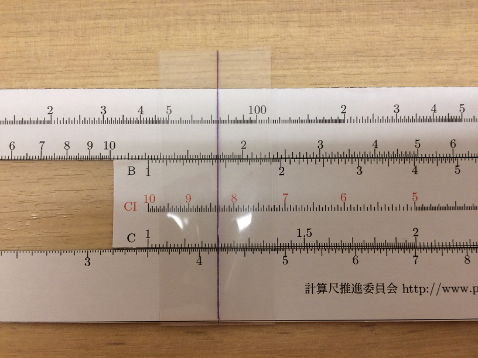
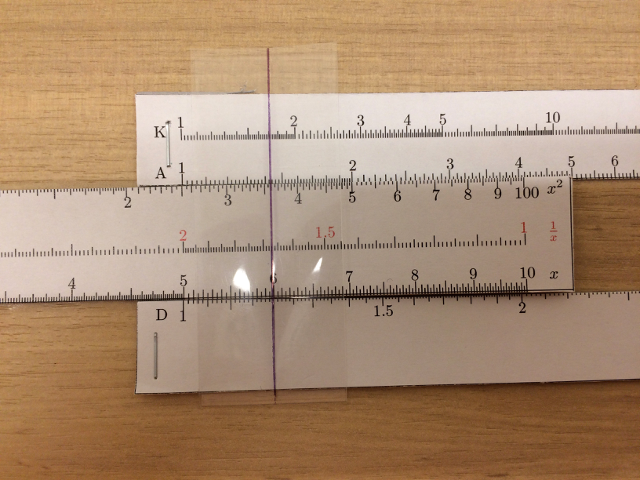
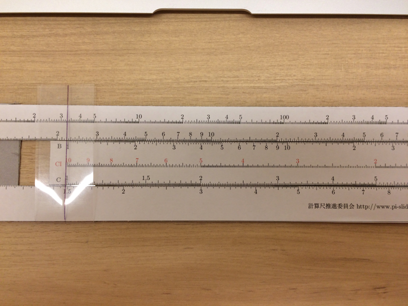
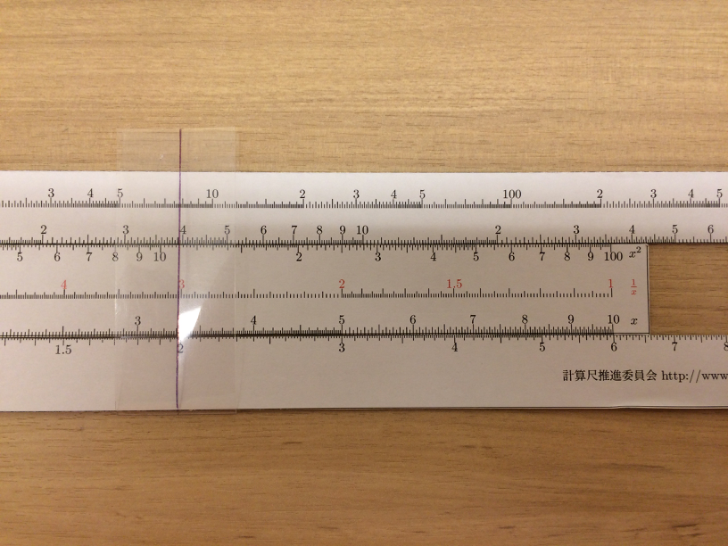
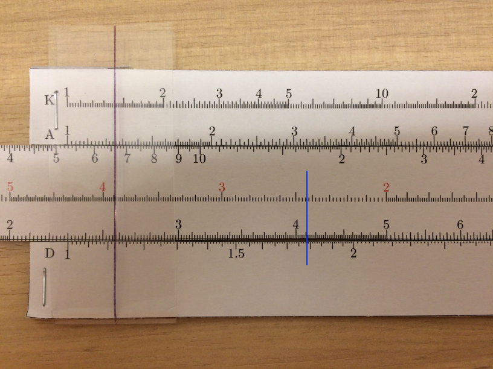
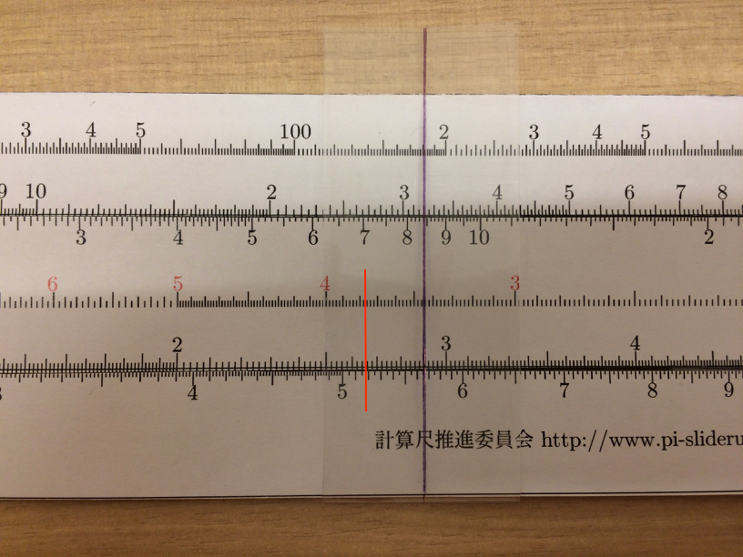
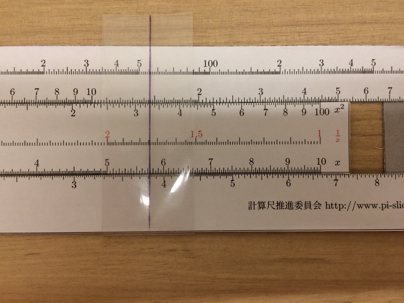

# J2-計算尺の使い方
## 参考書
図書館から借りた計算尺の本とPDFから作った簡易計算尺で使い方を勉強しました。

「計算尺の使い方」寺田　道彦　著

### 計算尺PDF
以下のPDFとダンボール紙を使って簡易計算尺を作りました。 

- https://staff.aist.go.jp/tominaga-daisuke/sliderule/rectilinear/index.html ))
- http://www.pi-sliderule.net/sliderule/make/pdf.html

出来上がった簡易計算尺は、こんな感じです。

## 掛け算

### 内尺法

$$
a \times b
$$

- カーソルをD尺のaに合わせる
- CI尺をbをカーソルに合わせる
- CI尺の左基準線とD尺と交わる点が解

例）4.12 x 8.34 = 35

### 標線法

$$
a \times b
$$

- D尺のaをC尺の右基準線に合わせる
- C尺のbとD尺の交わる点が解

例）2 x 6 = 12

### 割り算
$$
a \div b
$$

- D尺のaとC尺のbを合わせる
- C尺の左基準線とD尺の交わる点が解

例）3 ÷ 2 = 1.5

### 標線法

$$
a \div b
$$

- D尺のaとC尺の右基準線を合わせる
- CI尺のbとD尺の交わる点が解

例）6 ÷ 2 = 3

### ３数の乗除算
$$
a \times b \div c
$$

- D尺のaとCI尺のbを合わせ
- CI尺のcにカーソルを合わせD尺との交点が解

例）1.782 x 2.43 / 3.84 = 1.127

- D尺の1.782とCI尺の2.43にカーソルを合わせ、D尺とCI尺を固定
- カーソルをCI尺の3.84に移動し、D尺との交点1.12が解

$$
a \times b \times c
$$

- D尺のaとCI尺のbを合わせ
- C尺のcとD尺の交点が解

例）5.64 x 3.46 x 2.65 = 51.7

- D尺の5.64にカーソルを合わせ
- CI尺の3.46をカーソルに合わせ（内尺法）
- C尺の2.65にカーソルを合わせ（標線法）

内尺法と標線法を繰り返すことで、複数の乗除算が繰り返しできることがポイント

例）(9.95 x 6.72) / (17.38 x 7.78) = 0.665

- D尺の9.95とCIの6.72にカーソルを合わせ
- C尺の左基準とD尺の交点にカーソル移動
- C尺の右基準をカーソルに合わせる（基準の置き換え）
- CI尺の1.73にカーソルを移動（標線法）
- C尺を7.78に合わせC尺の右基準との交点（内尺法）

## 平方
$$
a^2
$$

- C尺のaにカーソルを合わせA尺との交点が解

### 平方を含む乗除算
以下のように式を変形して、計算します。

$$
a \times b^2 = (\sqrt{a} \times b)^2
$$

- A尺のaにカーソルを合わせ
- CI尺のbをカーソルに合わせ
- CI尺の左基準線にカーソルを合わせA尺との交点が解

$$
\frac{a}{b^2} = \left ( \frac{ \sqrt{a} } {b} \right )^2
$$

- A尺のaにカーソルを合わせ
- C尺のbをカーソルに合わせる
- C尺の右基準線にカーソルを合わせA尺との交点が解

### 比例
$$
a : b = c : d
$$

- D尺のbにカーソルを合わせ
- C尺のaにカーソルを合わせ
- 内尺を固定
- カーソルをC尺のcに合わせる
- D尺の交点が解

### 反比例
$$
a \times b = c \times d
$$

- D尺のbにカーソルを合わせ
- CI尺のaにカーソルを合わせ 内尺を固定
- CI尺のcにカーソル合わせ
- D尺の交点が解

### 対数
常用対数（底が１０）L尺を使う

$$
log \, a
$$

- D尺のaにカーソルを合わせ
- L尺との交点読む

仮数部がもとまる
例）log 250

- D尺の2.50にカーソルを合わせる
- L尺とカーソルの交点から仮数0.398が求まる
- 桁数3-1 = 2が指標なので、2.398と求まる

### 自然対数
lnx を求める時には

$$
\begin{eqnarray}
\frac{log_{10} x} {log_{10} e} & =  & ln \, x \\
log_{10} x & = & log_{10} e \, ln \, x \\
log_{10} e & =  & 0.434294 ... なので、 \\
ln \, x & = & 2.30 \, log_{10} x 
\end{eqnarray}
$$

$\sqrt{5.3}$ が2.3にほぼ等しいので、これを使って計算するのが常套手段みたい！

### 指数
LL1, LL2, LL3, LL4

$$
a^b
$$

- LL尺のaにカーソルを合わせ
- CI尺のbにカーソルを合わせ
- CI尺の左基準線にカーソルを合わせ
- カーソル位置のLL尺の値が解
