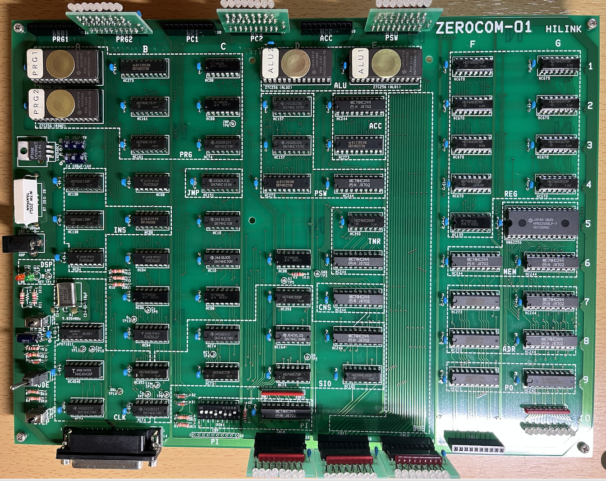
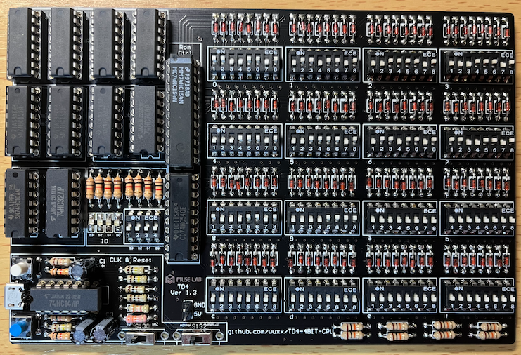
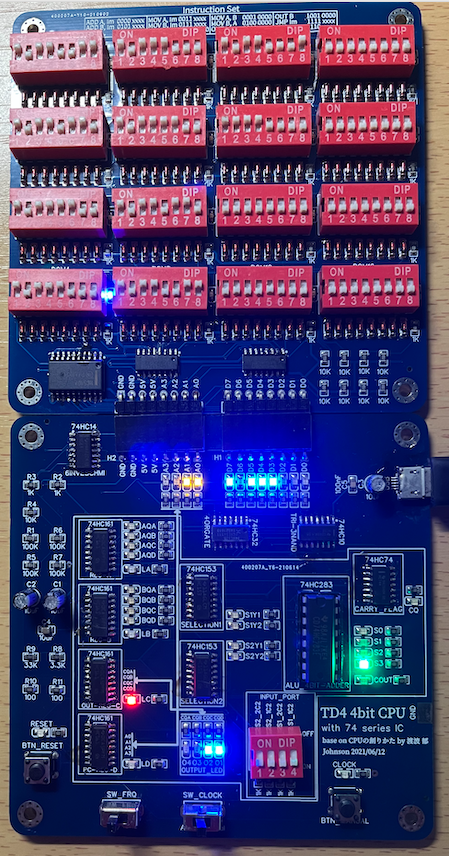
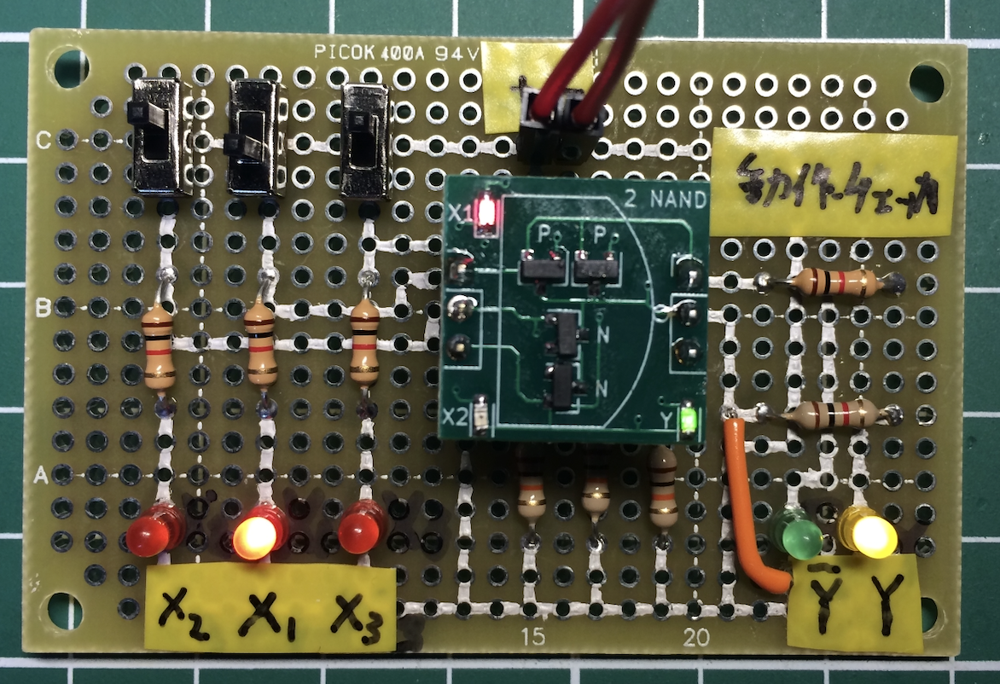
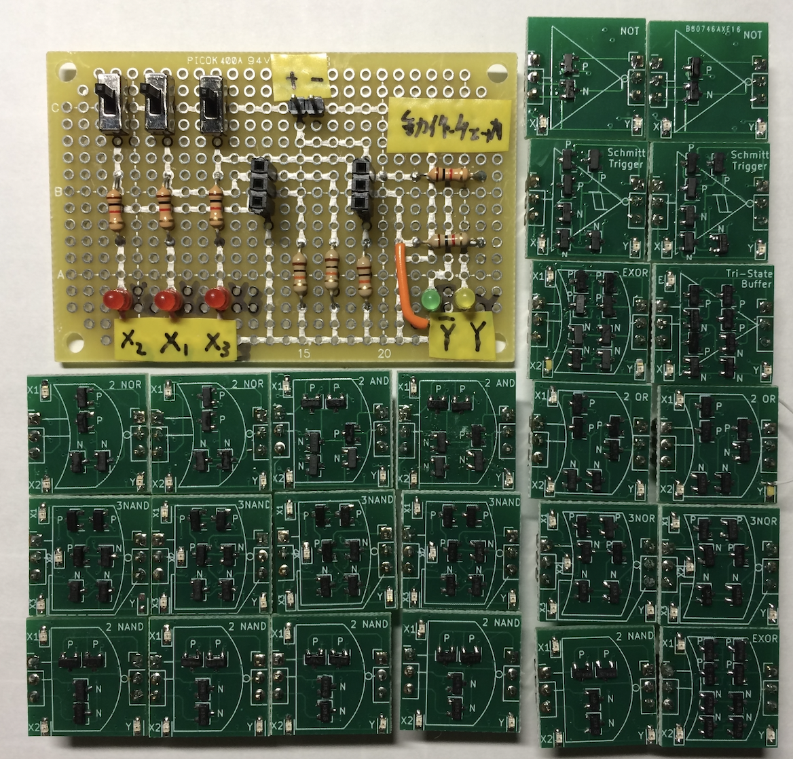
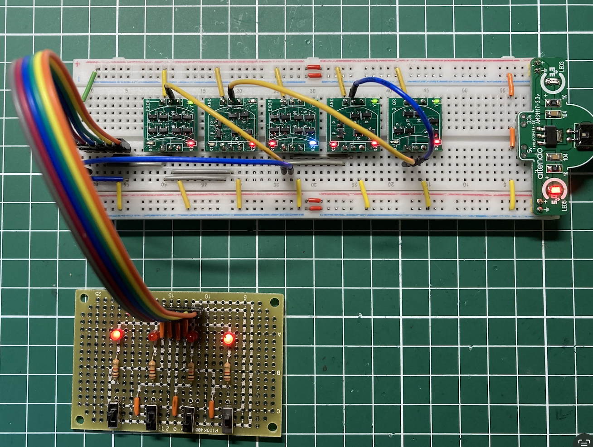
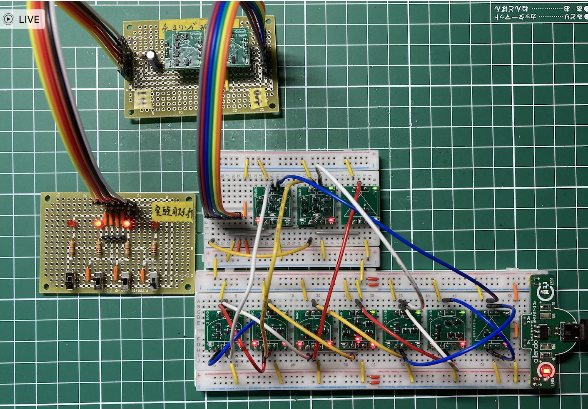
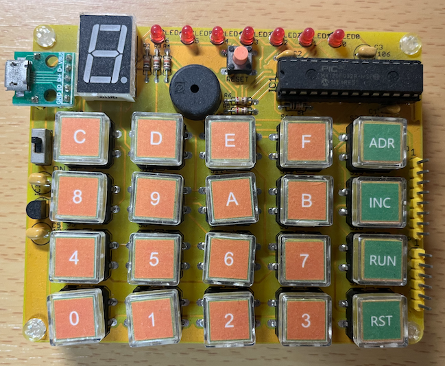

## CPUをつくる
私がNATに入ってArduino勉強を始めた時にやってみたかったことは、子供たちにマイクロコンピュータ（以下マイコンと省略します）の仕組みを分かってもらえる教材を作ることでした。

私が最初にマイコンと出会ったのは、大学生時代に東京秋葉原駅前の電気ビルにあったBIT-INNに展示されていたTK-80でした（以下にWikipediaからの写真を引用します）。


基板がそのままむき出しで、数値とA-Fを表示するセグメントLEDが４＋４個とテンキーが付いたものがコンピュータかと思われるかも知れませんが、初期のマイコンはこのようにテンキーを使って直接マシン語（CPUの命令）打ち込んでプログラムを入力しました。

この時一緒にいた友人が「これからはマイコンの時代が来る」と言って、二人で盛り上がったのを今でも覚えています。

## はじめて作ったCPU
社会人になり、すぐに購入したのが、FM-7というパソコンでした。FM-7には拡張ソケットがあり、ハードウェアを追加することができました。ハードウェアに関する知識を習得するために「トランジスタ技術」という雑誌を定期購読しました。

ある時、「トランジスタ技術」の別冊に「作れば解るCPU」（1994年11月1日発行）の広告が載っていました。CPUの構造や動作原理をオリジナルなCPU（ゼロコン）を設計し、プログラミング可能な状態まで作り込む素晴らしい一冊でした。


すぐにこの本を購入し、秋葉原に通いながら必要な部品と工具を揃え、組み立てました。
当時は、コンピュータキットなどはなく、部品を配置するプリント基板のみが販売されており、必要な部品は読者が自分で購入するのが当たり前でした。
思ったら突っ走る私ですから、間違った部品を買ってきて、組み立て後に付け直しなど紆余曲折を経て、完成までこぎ着けました。



この本の特徴は、オリジナルのCPUの上にZ80エミュレータのプログラムを書き込んで、Z80のマシン語を動かせたことです。つまり必要最低限のCPUとメモリがあれば、プログラミングによって異なるCPUとして動かせると言うことでした。まさにチューリングマシンを再現したものでした。

残念なことはゼロコンはとても高価で子供たちに簡単に体験できるものではありませんでした。

### NAND回路とNOR回路
1969年に月面着陸したアポロ宇宙船で使用されたコンピュータ（AGC:Apollo Guidance Cimputer）には、1958年に発明されたばかりのICが使われました。当時のICは歩留まりも低く、多くの論理回路を用意するよりもNORの1種類のICに集中し、アポロ11号に間に合わせる方策が取られました。

NAND回路は、2つの信号のANDを取り、そのNOTを返す論理ゲートです。
NAND回路を組み合わせることによってNOT, AND, OR, NOR, XOR回路を作ることができます。更にNAND回路とNOR回路は相互に変換可能であることから、AGCではNOR ICがターゲットとして採用されたものと思われます。

### トランジスタでNAND回路を作ってみる
<a href="https://take-pwave.sakura.ne.jp/index.php?cmd=read&page=Arduino%E5%8B%89%E5%BC%B7%E4%BC%9A%2F08-%E3%82%AA%E3%82%B7%E3%83%AD%E3%82%B9%E3%82%B3%E3%83%BC%E3%83%97%E3%82%92%E4%BD%BF%E3%81%A3%E3%81%A6%E3%81%BF%E3%82%8B&word=NAND">Arduino勉強会/08-オシロスコープを使ってみる</a>
では、Arduinoとブレッドボードに接続した抵抗を組み合わせて、簡易オシロスコープを用意し、NAND回路の波形をPCに表示しました。

信号生成器から出力されたクロック波形をNAND回路に入力し、NAND処理された信号が出力されていることを確認しました。さらに「ヒゲ」と呼ばれる回路の遅延によって生じるノイズ信号も観測できました。


## CPUの創り方
ゼロコンから10年弱を経て、汎用のICのみを使い4bitのCPUの作り方を解説した「CPUの創りかた」が2003年10月1日に発売されました。このCPUの画期的なところは、ディップスイッチをプログラムを書き込むROMに使ったことでした。
これにより、汎用ICでレジスタ、メモリのローダー、命令のデコーダのみを作ればよいので、少ない部品で構成できたのだと思います。


当時は、部品を配置するプリント基板も販売されていなかったので、実際につくることはできませんでしたが、最近中国の販売サイトとても安価にキットを購入することができるようになりました。

「TD4 CPU」と検索してみたください。4,000円〜8,000円で様々な製品が販売されています。特にLEDを多用し、レジスタの値やプログラムカウンタの位置を確認できる製品まで揃っています。





## CPUはこうやって動いている
2020年には、究極のCPUを作った記事がトランジスタ技術2020年5月号で発表されました。
なんと汎用ICを使わず、トランジスタのみでCPUを作ったと制作過程と付録基板で様々な回路を作りその動作確認の様子を動画で解説したDVDと付録のプリント基板が付いていました。

フルセットキット「CPU組み立てキット(ロボット用パーツ付き)」も販売されてましたが、とても作れるとは思わなかったので購入は断念しました。

### 付録基板の内容
プリント基板を作る前に準備するのが、「動作チェッカー」です。

動作チェッカーは、X1, X2, X3の信号を入力し、出力$Y, \bar{Y}$をLEDで出力します。



基板で入っていた回路は、以下の通りです。
- NOR x 2
- AND x 2
- 3入力NAND x 4
- 2入力NAND x 5
- NOT x 2
- OR x 2
- NOR x 2
- EXOR x 2
- シュミットトリガー x 2（チャタリング防止用）
- Tri-State Buffer x 1




### 付録基板で1bitメモリを作る
ブレッドボードにスイッチをセットし、回路の動作をチェックします。



メモリを作るにはクロックが必須となります。実験用スイッチでオン／オフを入力したときにスイッチの接点分でチャタリングが発生しますが、これを信号から除くためにシュミットトリガー回路を2個使ってチャタリング防止回路を挿入します。

スイッチ、チャタリング防止回路、１bitメモリを実装すると以下のようになりました。




## 大人の科学Vol.24 GMC-4
時代は少し戻り、2009年6月に学研の
<a href="https://otonanokagaku.net/magazine/vol24/">大人の科学Vol.24</a>
が発売され、付録に4bitマイコンGMC-4が付いてきました。GMC-4は、学研電子ブロックFX-マイコンR-165の復刻版で、メモリが64個（4bit x 64）に増え、音や外部IOが使える拡張コマンドが用意されていることが特徴です。


### ArduinoでGMC-4を作る
<a href="https://take-pwave.sakura.ne.jp/index.php?Arduino%E5%8B%89%E5%BC%B7%E4%BC%9A%2F0E-GMC4%E3%82%92Arduino%E3%81%A7%E4%BD%9C%E3%81%A3%E3%81%A6%E3%81%BF%E3%82%8B">
Arduino勉強会/0E-GMC4をArduinoで作ってみる</a>
では、Arduinoを使ってGMC-4を作ってみました。

Arduinoには、Keyboardクラスが用意されており、プッシュスイッチだけで簡単にキーボードを作ることができます。

完成したArduino版GMC-4はこんな風にできました。


これでもプッシュボタン周りの配線は大変なので、テクノペンを使って配線した
<a href="https://take-pwave.sakura.ne.jp/index.php?Arduino%E5%8B%89%E5%BC%B7%E4%BC%9A%2F0L-lbeDuino%E3%81%A72%E4%BB%A3%E7%9B%AEGMC4%E3%82%92%E4%BD%9C%E3%81%A3%E3%81%A6%E3%81%BF%E3%82%8B">2代目GMC-4</a>
を作りました。


### GMC-4キット（Orange-4）
はじめての人には、2代目GMC-4でも大変かなと思っていたら、
<a href="https://store.shopping.yahoo.co.jp/orangepicoshop/">「オレンジピコショップ」</a>
からGMC-4のキットがORANGE-4が販売され、今でも入手可能なことを分かりました。



興味のある方は、購入し、組み立ててみてください。

### GMC4コンパイラーの作成
GMC-4は教育用に使えると感じ、ANTLRを使ってGMC-4用のCライクな簡易言語コンパイラーを作ってみました。

<a href="https://take-pwave.sakura.ne.jp/index.php?GMC-4%E3%82%B3%E3%83%B3%E3%83%91%E3%82%A4%E3%83%A9%E3%83%BC">GMC-4コンパイラー</a>
の「Gem4c.zip」をクリックしてダウンロードしてください。

zipファイルを展開したディレクトリに移動してください。

ターミナルで以下の用に入力すればコンパイル結果が出力されます。例として1.cのファイルをコンパイルしてみます。

```bash
$ java -cp lib/stringtemplate.jar:lib/antlr-3.0.1.jar:bin Main <1.c
TIA	f
TIY	0
AM
L1: TIY	0
TIA	0
AIA	1
M-
JUMP	L2
TIY	0
MA
AO
CAL SHTS
TIY	0
TIA	1
M-
TIY	0
AM
TIA	a
CAL TIMR
JUMP	L1
L2: CAL ENDS
L3: JUMP	L3
```

1.cの内容は以下の通りです。
```C
int	a;
a = 15;
while (a > 0) {
	out(a);
	shts();
	a = a - 1;
	timer(10);
}
```


