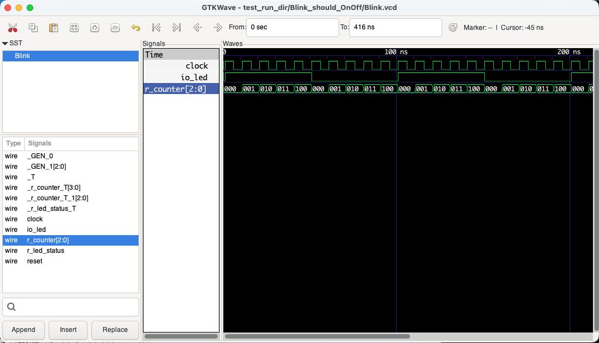
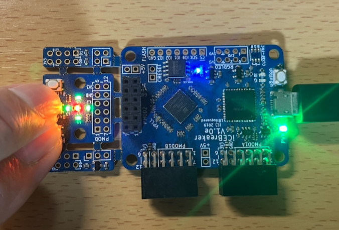
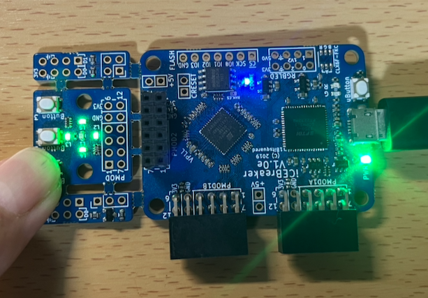
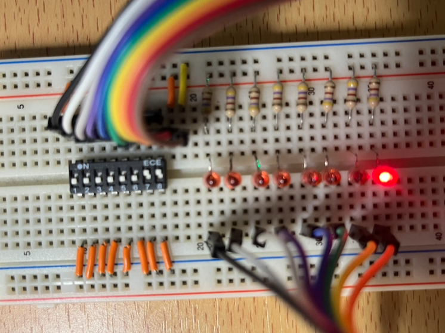
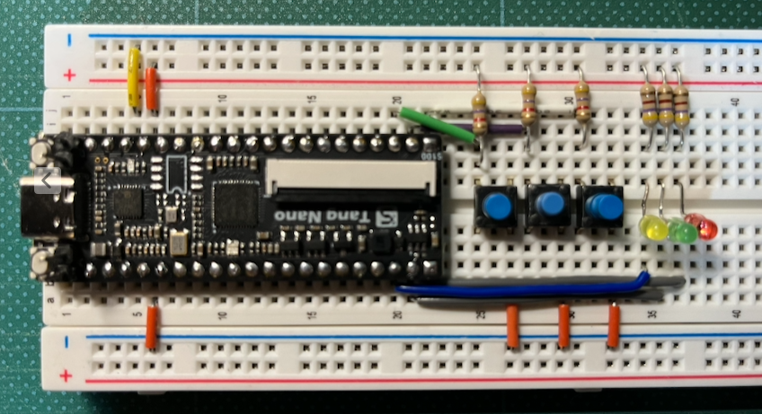
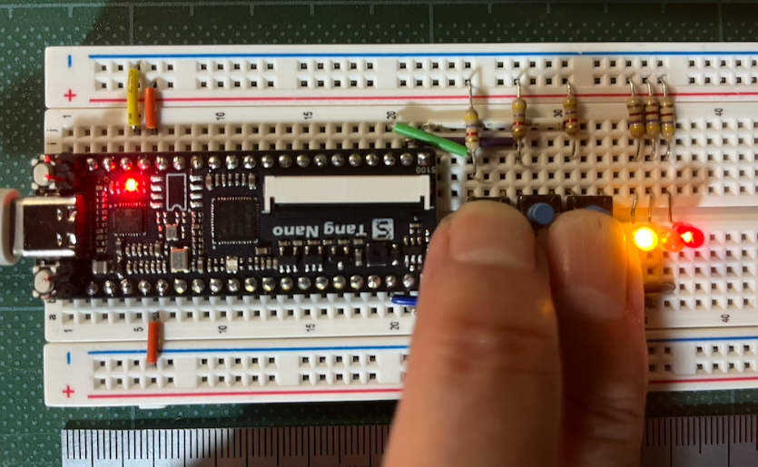

# もう一度Chiselを勉強する（2026/05/05）
<a href="">42-QuickChisel.ipynb(動かして学ぶChisel勉強ノート)</a>を書いてからApio周りも変化したので、
ここでもう一度Chiselを勉強し直そうと思います。

最新のApioを見ると、サポートボードにtang-nanoシリーズが追加されていることが分かりました。
手元のtang-nanoへの書き込みはうまく行きませんでしたので、Amazonでtang-nano-20kを発注しているところです。


## conda環境を使ってChisel環境を構築する
「動かして学ぶChisel勉強ノート」では、docker環境を使ってchiselの環境を構築しましたが、Dockerの仮想環境環境立ち上げる度にsbtの環境をダウンロードするのに時間がかかるため、今回はconda環境を使ってChisel環境を作成します。

私は、MacBook Air M2を使っているため、brewでminiforgeをインストールしてconda環境を構築しました（Windowsの方はMinicondaを使われると良いと思います）。

Macでのconda環境はbrewコマンドを使って以下のようにインストールします。

```bash
$ brew install miniforge
```

ここで、一度ターミナルソフトを再起動します。

### FPGA開発環境(fpga_env)の構築
私は、「Chiselで始めるFPGA電子工作」（堀江 徹也著）のhorie-t/chisel-seed.g8というテンプレートを使うため、この本で紹介されているJDK 11をインストールします。

それでは、FPGAの開発環境をcondaを使って作成します。

最初に、シミュレータの結果を表示するために、brewコマンドでgtkwaveをインストールします。
```bash
$ brew install gtkwave
```
私の使っているMacBookAir M2ではgtkwaveが動かないみたいで、以下のURLからoss-cad-suite-darwin-arm64-20260504.tgzをダウンロードし、そこに入っているgtkwaveを~/binに入れて使っています（https://qiita.com/ttrsato/items/41fc9162fa9d3885a1b8 参照）
- https://github.com/YosysHQ/oss-cad-suite-build/releases

次にcondaのcreateコマンドでfpga_envという名前の環境を作成します。

```bash
$ conda create -n fpga_env
```

fpga_envを使用するときは、必ずfpga_envを有効化（activate）する必要があります。
以下のコマンドを使ってfpga_envを有効化します。

```bash
$ conda activate fpga_env
```

次にChiselでのFPGA開発で使用するsbt, verilator, openjdkをインストールします。
```bash
(fpga_env)$ conda install sbt verilator openjdk=11
```

さらにpipコマンドを使ってapioとtinyprogをインストールします。
```bash
(fpga_env)$ pip install apio tinyprog
```

### 新しいApioで使えるボードが増えている
最新のApioでは使えるボードが増えています。

どのようなボードが使えるか表示してみます。
```bash
(fpga_env)$ apio boards
Fetching 'https://github.com/fpgawars/apio/raw/main/remote-config/apio-1.4.x.jsonc'

Apio Supported Boards                                                                         
┌─────────────────────────────────┬───────┬─────┬─────┬─────────────────────┬────────────────┐
│ BOARD-ID                        │ EXMP… │ AR… │ SI… │ PART-NUMBER         │ PROGRAMMER     │
├─────────────────────────────────┼───────┼─────┼─────┼─────────────────────┼────────────────┤
│ alchitry-cu                     │    1  │ ic… │ 8k  │ ICE40HX8K-CB132     │ iceprog        │
│ alhambra-ii                     │    13 │ ic… │ 8k  │ ICE40HX4K-TQ144     │ openfpgaloader │
│ arice1                          │       │ ic… │ 5k  │ ICE40UP5K-SG48      │ iceprog        │
│ blackice                        │    2  │ ic… │ 8k  │ ICE40HX4K-TQ144     │ blackiceprog   │
│ blackice-ii                     │       │ ic… │ 8k  │ ICE40HX4K-TQ144     │ blackiceprog   │
│ blackice-mx                     │       │ ic… │ 8k  │ ICE40HX4K-TQ144     │ blackiceprog   │
│ edu-ciaa-fpga                   │    4  │ ic… │ 8k  │ ICE40HX4K-TQ144     │ iceprog        │
│ fomu                            │    2  │ ic… │ 5k  │ ICE40UP5K-UWG30     │ dfu            │
│ fpga101                         │       │ ic… │ 5k  │ ICE40UP5K-SG48      │ iceprog        │
│ go-board                        │    3  │ ic… │ 1k  │ ICE40HX1K-VQ100     │ iceprog        │
│ ice40-hx1k-evb                  │    1  │ ic… │ 1k  │ ICE40HX1K-VQ100     │ iceprogduino   │
│ ice40-hx8k                      │    1  │ ic… │ 8k  │ ICE40HX8K-CT256     │ iceprog        │
│ ice40-hx8k-evb                  │    1  │ ic… │ 8k  │ ICE40HX8K-CT256     │ iceprogduino   │
│ ice40-ul1k-breakout             │       │ ic… │ 1k  │ ICE40UL1K-CM36A     │ iceprog        │
│ ice40-up5k                      │    3  │ ic… │ 5k  │ ICE40UP5K-SG48      │ iceprog        │
│ iceblink40-hx1k                 │       │ ic… │ 1k  │ ICE40HX1K-VQ100     │ iceburn        │
│ icebreaker                      │    3  │ ic… │ 5k  │ ICE40UP5K-SG48      │ iceprog        │
│ icebreaker-bitsy0               │       │ ic… │ 5k  │ ICE40UP5K-SG48      │ dfu            │
一部省略
├─────────────────────────────────┼───────┼─────┼─────┼─────────────────────┼────────────────┤
│ brs-100-gw1nr9                  │    1  │ go… │ 9k  │ GW1NR-LV9QN88PC6/I5 │ openfpgaloader │
│ sipeed-tang-nano                │       │ go… │ 1k  │ GW1N-LV1QN48C6/I5   │ openfpgaloader │
│ sipeed-tang-nano-1k             │       │ go… │ 1k  │ GW1NZ-LV1QN48C6/I5  │ openfpgaloader │
│ sipeed-tang-nano-20k            │    3  │ go… │ 20k │ GW2AR-LV18QN88C8/I7 │ openfpgaloader │
│ sipeed-tang-nano-4k             │    1  │ go… │ 4k  │ GW1NSR-LV4CQN48PC7… │ openfpgaloader │
│ sipeed-tang-nano-9k             │    4  │ go… │ 9k  │ GW1NR-LV9QN88PC6/I5 │ openfpgaloader │
└─────────────────────────────────┴───────┴─────┴─────┴─────────────────────┴────────────────┘
Total of 82 boards
```


## Wireの例題を試してみる
準備が整ったので、「動かして学ぶChisel勉強ノート」で最初に試したWireを試してみましょう。

```bash
(fpga_env)$ sbt new horie-t/chisel-seed.g8
A minimal Chisel project. 

name [ChiselTemplateProject]: wire

Template applied in /Users/take/proj/tang-nano/chisel/tmp/./wire
```

テンプレート使ってwireフォルダにプロジェクトが作成されます。
```bash
(fpga_env)$ ls wire
build.sbt			scalastyle-config.xml
project				scalastyle-test-config.xml
README.md			src
```

ここで必ずproject/build.propertiesのsbt.version=1.4.4を1.3.10に変更してください。

次に不要なファイルを削除してから、wire.scalaを作ります。
```bash
(fpga_env)$ rm -rf src/main/scala/* src/test/scala/*
```

エディタでsrc/main/scala/wire.scalaに以下のソースを書き込みます。
```scala
import chisel3._
import chisel3.stage._

import java.io.PrintWriter

class Wire extends RawModule {
    val io = IO(new Bundle {
        val switch = Input(Bool())
        val led = Output(Bool())
    })

    io.led := io.switch
}

object VerilogEmitter extends App {
    val writer = new PrintWriter("target/wire.v")
    writer.write(ChiselStage.emitVerilog(new Wire))
    writer.close()
}
```

sbtを使ってwire.scalaからverilogのソースを生成します。
```bash
(fpga_env)$ sbt run
[info] Loading settings for project wire-build from plugins.sbt ...
[info] Loading project definition from /Users/take/proj/tang-nano/chisel/tmp/wire/project
[info] Loading settings for project root from build.sbt ...
[info] Set current project to wire (in build file:/Users/take/proj/tang-nano/chisel/tmp/wire/)
[info] Compiling 1 Scala source to /Users/take/proj/tang-nano/chisel/tmp/wire/target/scala-2.12/classes ...
[warn] there were two feature warnings; re-run with -feature for details
[warn] one warning found
[info] running VerilogEmitter 
[info] [0.001] Elaborating design...
[info] [0.025] Done elaborating.
[success] Total time: 2 s, completed 2026/05/04 14:25:15
```

生成されたwire.vはtargetフォルダに作られるので、ここに移動してapioの作業に移ります。
```bash
(fpga_env)$ cd target
(fpga_env)$ ls
scala-2.12	streams		wire.v
```

apio.iniを生成します。apio createに渡すパラメータは以下の通りです。
- --board icebreaker : ボードにiceBreakerを使用する
- --top-module Wire  : トップモジュールをWireとする

```bash
(fpga_env)$ apio create --board icebreaker --top-module Wire
Creating apio.ini file ...
The file 'apio.ini' was created successfully.
```

apio.iniの中身は以下のように作られます。
```bash
(fpga_env)$ cat apio.ini
# APIO project configuration file.
# For details see https://fpgawars.github.io/apio/docs/project-file

[env:default]
board = icebreaker
top-module = Wire
```

次にボードのIOとピンのマッピングを指定します。iCEBreakerのピン番号は、以下のページに詳しく説明されています。

- https://github.com/icebreaker-fpga/icebreaker


ピン定義ファイルwire.pcfを以下の内容で作成してください。
```plan
set_io clock 35
set_io reset 18
set_io io_led 26
set_io io_switch 20
```

それでは、Apioを使ってwire.vの論理合成をします。
```bash
(fpga_env)$ apio build
Using env default (icebreaker)
Setting shell vars.
----------------------------------------------------------------------------------------------
yosys -p "synth_ice40 -top Wire -json _build/default/hardware.json " -q -DSYNTHESIZE wire.v
nextpnr-ice40 --up5k --package sg48 --json _build/default/hardware.json --asc _build/default/hardware.asc --report _build/default/hardware.pnr --pcf wire.pcf -q
Warning: unmatched constraint 'clock' (on line 1)
Warning: unmatched constraint 'reset' (on line 2)
2 warnings, 0 errors
icepack _build/default/hardware.asc _build/default/hardware.bin
================================ [SUCCESS] Took 1.04 seconds =================================
```

完成したバイナリをボードに書き込みます。
```bash
(fpga_env)$ apio upload
Using env default (icebreaker)
Setting shell vars.
Scanning for a USB device:
- FILTER [VID=0403, PID=6010, REGEX="^(Dual RS232-HS)|(iCEBreaker.*)"]
- DEVICE [0403:6010] [0:5] [FTDI] [Dual RS232-HS] []
----------------------------------------------------------------------------------------------
iceprog -d d:0/5 _build/default/hardware.bin
init..
cdone: high
reset..
cdone: low
flash ID: 0xEF 0x70 0x18 0x00
file size: 104090
erase 64kB sector at 0x000000..
erase 64kB sector at 0x010000..
programming..
done.                 
reading..
VERIFY OK             
cdone: high
Bye.
================================ [SUCCESS] Took 5.24 seconds =================================
```


## 「動かして学ぶChisel勉強ノート」の例題を復習
続けて「動かして学ぶChisel勉強ノート」で試した例題を試します。

### Lチカ(Blink)
wire（結線）の次は、もちろんLチカ（LEDの点滅）と言うことで、Blinkを作ります。

```bash
(fpga_env)$ sbt new horie-t/chisel-seed.g8
A minimal Chisel project. 

name [ChiselTemplateProject]: blink

Template applied in /src/./blink

(fpga_env)$ cd blink
(fpga_env)$ rm -rf src/main/scala/* src/test/scala/*
```

src/main/scala/bink.scalaをVSCodeで以下のように作成します。
```scala
import chisel3._
import chisel3.stage._

import java.io.PrintWriter

// １秒ごとにOn/Offを繰り返す
class Blink(clk_frequency: Int) extends Module {
    // I/Oを定義：出力ポートled
    val io = IO(new Bundle {
        val led = Output(Bool())
    })

    // LEDの状態を保持
    val r_led_status = RegInit(true.B)

    // １秒分のクロックカウント
    val MAX_CLOCK_COUNT = (clk_frequency - 1).U

    // １秒分のカウンターに必要なビット数を.getWidthで取得
    val r_counter = RegInit(0.U(MAX_CLOCK_COUNT.getWidth.W))

    // カウンターがMAX_CLOCK_COUNTに達したら、LEDの状態を反転させる
    when (r_counter === MAX_CLOCK_COUNT) {
        // LEDの状態反転
        r_led_status := ~r_led_status
        // カウンターのリセット
        r_counter := 0.U
    } otherwise {
        r_counter := r_counter + 1.U
    }

    // LEDの状態を出力信号にセット
    io.led := r_led_status
}

object VerilogEmitter extends App {
    val writer = new PrintWriter("target/blink.v")

    // iCEBreakerのクロックは12MHz
    writer.write(ChiselStage.emitVerilog(new Blink(12000000)))
    writer.close()
}
```

### テストベンチ
Chiselのテストベンチ機能を試します。

VSCodeでsrc/test/scala/blink_tb.scalaを以下のように作成します。

```scala
import chisel3._
import org.scalatest._
import chiseltest._

import chiseltest.experimental.TestOptionBuilder._
import chiseltest.internal.WriteVcdAnnotation

class BlinkTest extends FlatSpec with ChiselScalatestTester {

    behavior of "Blink"

    it should "クロック周波数でOn/Offを繰り返す" in {

        // テストのためクロック周波数を5とし、４サイクル分実行する
        val clock_frequency = 5

        test(new Blink(clock_frequency)).withAnnotations(Seq(WriteVcdAnnotation)) { c =>
            // ４サイクル分のOn/Offをセット（期待値に使用）
            val led_cycle = Range(0, 8).map(_ % 2 === 0)
            for (expected_led <- led_cycle) {
                var i = 0
                while(i != clock_frequency) {
                    c.io.led.expect(expected_led.B)
                    c.clock.step()
                    i += 1
                }
            }
        }
    }
}

```

テストベンチの実行は、runの代わりにtestを指定します。
```bash
(fpga_env)$ sbt test
[info] Loading settings for project blink-build from plugins.sbt ...
[info] Loading project definition from /Users/take/proj/Chisel-Again/blink/project
[info] Loading settings for project root from build.sbt ...
[info] Set current project to blink (in build file:/Users/take/proj/Chisel-Again/blink/)
[info] Compiling 1 Scala source to /Users/take/proj/Chisel-Again/blink/target/scala-2.12/test-classes ...
[warn] there was one feature warning; re-run with -feature for details
[warn] one warning found
[info] [0.001] Elaborating design...
[info] [0.052] Done elaborating.
file loaded in 0.026519833 seconds, 14 symbols, 12 statements
test Blink Success: 0 tests passed in 42 cycles in 0.028109 seconds 1494.17 Hz
[info] BlinkTest:
[info] Blink
[info] - should クロック周波数でOn/Offを繰り返す
[info] ScalaTest
[info] Run completed in 866 milliseconds.
[info] Total number of tests run: 1
[info] Suites: completed 1, aborted 0
[info] Tests: succeeded 1, failed 0, canceled 0, ignored 0, pending 0
[info] All tests passed.
[info] Passed: Total 1, Failed 0, Errors 0, Passed 1
[success] Total time: 2 s, completed 2026/05/05 11:12:15
```
最後の"All tests passed."で合格だったことが分かります。

先にbrewでインストールしておいたgtkwaveを使ってテスト結果を可視化してみましょう。


```bash
(fpga_env)$ ~/bin/gtkwave test_run_dir/Blink_should_OnOff/Blink.vcd
```

SSTのBlinkをクリックし、Signalsからclock, io_led, _r_counter_TをSignalsにドラッグすると以下のように波形が表示されます（マイナス虫眼鏡で時間スケールを大きくしています）。



### Lチカのビルド
ターミナルでsbt runコマンドを実行し、Verilogファイルを生成します。

```bash
(fpga_env)$ sbt run
[info] Loading settings for project blink-build from plugins.sbt ...
[info] Loading project definition from /Users/take/proj/Chisel-Again/blink/project
[info] Loading settings for project root from build.sbt ...
[info] Set current project to blink (in build file:/Users/take/proj/Chisel-Again/blink/)
[info] running VerilogEmitter 
[info] [0.000] Elaborating design...
[info] [0.036] Done elaborating.
[success] Total time: 1 s, completed 2026/05/05 13:25:42
```

targetディレクトリにblink.vが作成されています。
```bash
(fpga_env)$ cd target 
(fpga_env)$ ls
blink.pcf	blink.v		scala-2.12	streams		test-reports
```

ApioコマンドでiceBreakerボード用のapio.iniを生成します。

```bash
(fpga_env)$ apio create --board icebreaker --top-module Blink
Fetching 
'https://github.com/fpgawars/apio/raw/main/remote-config/apio-1.4.x.jsonc'
Creating apio.ini file ...
The file 'apio.ini' was created successfully.
```

IOのピンマッピングをblink.pcfに以下のように定義します。

```pcf
set_io clock 35
set_io reset 18
set_io io_led 26
```

apio uploadコマンドでiCEBreakerに書き込みます。

```bash
(fpga_env)$ apio upload
Using env default (icebreaker)
Setting shell vars.
Scanning for a USB device:
- FILTER [VID=0403, PID=6010, REGEX="^(Dual RS232-HS)|(iCEBreaker.*)"]
- DEVICE [0403:6010] [0:6] [FTDI] [Dual RS232-HS] []
--------------------------------------------------------------------------------
yosys -p "synth_ice40 -top Blink -json _build/default/hardware.json " -q -DSYNTHESIZE blink.v
nextpnr-ice40 --up5k --package sg48 --json _build/default/hardware.json --asc _build/default/hardware.asc --report _build/default/hardware.pnr --pcf blink.pcf -q
icepack _build/default/hardware.asc _build/default/hardware.bin
iceprog -d d:0/6 _build/default/hardware.bin
init..
cdone: high
reset..
cdone: low
flash ID: 0xEF 0x70 0x18 0x00
file size: 104090
erase 64kB sector at 0x000000..
erase 64kB sector at 0x010000..
programming..
done.                 
reading..
VERIFY OK             
cdone: high
Bye.
========================= [SUCCESS] Took 6.13 seconds ==========================
```

## 2項演算（BinOps）
2項演算の例として、And（ビット積）を試します。

```bash
(fpga_env)$ sbt new horie-t/chisel-seed.g8
A minimal Chisel project. 

name [ChiselTemplateProject]: binops

Template applied in /Users/take/proj/Chisel-Again/./binops
```

不要なファイルを削除し、project/build.propertiesのsbt.version=1.4.4を1.3.10に変更します。

```bash
(fpga_env)$ cd binops
(fpga_env)$ rm -rf src/main/scala/* src/test/scala/*
```

src/main/scala/binops.scalaをVSCodeで以下のように作成します。
```scala
import chisel3._
import chisel3.stage._

import java.io.PrintWriter

// 集合体BinOpsIOを定義
class BinOpsIO extends Bundle {
    val a = Input(Bool())
    val b = Input(Bool())
    val c = Output(Bool())
}

// ２項演算（積）を行うBinOpsクラス
class BinOps extends Module {
    val io = IO(new BinOpsIO)

    io.c := io.a & io.b
}

// BinOpsのトップクラス
class BinOpsTop extends Module {
    val io = IO(new BinOpsIO)
    // BinOpsをモジュールとして使う時には、Moduleでのラップが必要
    val binops = Module(new BinOps)
    
    // オンボードのボタンとLEDは正論理なのでそのままセット
    binops.io.a := io.a
    binops.io.b := io.b
    io.c := binops.io.c
}

object VerilogEmitter extends App {
    val writer = new PrintWriter("target/binops.v")

    // iCEBreakerのクロックは12MHz
    writer.write(ChiselStage.emitVerilog(new BinOpsTop()))
    writer.close()
}
```

### 2項演算のビルド
ターミナルでsbt runコマンドを実行し、Verilogファイルを生成します。

```bash
(fpga_env)$ sbt run                       
[info] Loading settings for project binops-build from plugins.sbt ...
[info] Loading project definition from /Users/take/proj/Chisel-Again/binops/project
[info] Loading settings for project root from build.sbt ...
[info] Set current project to binops (in build file:/Users/take/proj/Chisel-Again/binops/)
[info] Compiling 1 Scala source to /Users/take/proj/Chisel-Again/binops/target/scala-2.12/classes ...
[info] running VerilogEmitter 
[info] [0.001] Elaborating design...
[info] [0.029] Done elaborating.
[success] Total time: 2 s, completed 2026/05/05 14:32:09
```

targetディレクトリにbinops.vが作成されています。
```bash
(fpga_env)$ cd target 
(fpga_env)$ ls
binops.v	scala-2.12	streams
```

ApioコマンドでiceBreakerボード用のapio.iniを生成します。

```bash
(fpga_env)$ apio create --board icebreaker --top-module BinOpsTop
Creating apio.ini file ...
The file 'apio.ini' was created successfully.
```

iceBreakerのボタン1とボタン２をio.a, io.bに、中央のLEDをio.cに割り当てます。

```pcf
set_io clock 35
set_io reset 18
set_io io_a 20
set_io io_b 19
set_io io_c 26
```

apio uploadコマンドでiCEBreakerに書き込みます。

```bash
(fpga_env)$ apio upload
Using env default (icebreaker)
Setting shell vars.
Scanning for a USB device:
- FILTER [VID=0403, PID=6010, REGEX="^(Dual RS232-HS)|(iCEBreaker.*)"]
- DEVICE [0403:6010] [0:6] [FTDI] [Dual RS232-HS] []
--------------------------------------------------------------------------------
yosys -p "synth_ice40 -top BinOpsTop -json _build/default/hardware.json " -q -DSYNTHESIZE binops.v
nextpnr-ice40 --up5k --package sg48 --json _build/default/hardware.json --asc _build/default/hardware.asc --report _build/default/hardware.pnr --pcf binops.pcf -q
icepack _build/default/hardware.asc _build/default/hardware.bin
iceprog -d d:0/6 _build/default/hardware.bin
init..
cdone: high
reset..
cdone: low
flash ID: 0xEF 0x70 0x18 0x00
file size: 104090
erase 64kB sector at 0x000000..
erase 64kB sector at 0x010000..
programming..
done.                 
reading..
VERIFY OK             
cdone: high
Bye.
========================= [SUCCESS] Took 6.00 seconds ==========================
```

IceBreakerのボタン１，ボタン２を使うと正論理の配線なので、そのままビット積の演算ができます。



ボタンが1個の場合には、消えます。



### 外部ボードの場合
自分でテスト用のボードを作成する場合、
ボードの入力や出力GNDになったときにオンやLEDの点灯するように通常の感覚とは逆の負論理で作られていることが多いです。

そこで、2項演算する前にBinOpsTopでラップして、負論理から正論理に変換します。
ブレッドボードのディップスイッチはPMOD1Aに接続し、LEDは、PMOD1Bに接続します。


```scala
// BinOpsのトップクラス
class BinOpsTop extends Module {
    val io = IO(new BinOpsIO)
    // BinOpsをモジュールとして使う時には、Moduleでのラップが必要
    val binops = Module(new BinOps)
    
    // 負論理から正論理に変換
    binops.io.a := ~io.a
    binops.io.b := ~io.b
    io.c := ~binops.io.c
}
```

binops.pcfに以下のように定義します
```pcf
set_io clock 35
set_io reset 18
set_io io_a 44 
set_io io_b 45
set_io io_c 28
```

ブレッドボードで動かした様子は、以下の通りです。



# tang-nano-1k
秋月に注文していたtang-nano-1k(1430円送料別)が届いたので、ブレッドボードにプッシュボタンとLEDを付けてテストしてみました。



## Wireの例題を試してみる
最初にWireの例題を試してみましょう。

テンプレート使ってwireフォルダにプロジェクトを作成します。
作業は、Chisel-Again/tang-nano-1kフォルダで行いました。

```bash
(fpga_env)$ sbt new horie-t/chisel-seed.g8
A minimal Chisel project. 

name [ChiselTemplateProject]: wire

Template applied in /Users/take/proj/Chisel-Again/tang-nano-1k/./wire
```

ここで必ずproject/build.propertiesのsbt.version=1.4.4を1.3.10に変更し、不要なファイルを削除してから、wire.scalaを作ります。
```bash
(fpga_env)$ cd wire
(fpga_env)$ vi project/build.properties
(fpga_env)$ rm -rf src/main/scala/* src/test/scala/*
```

### ボードの特徴をWireTopにまとめる
今回作成したブレッドボードは信号が０の時にLED点灯したり、スイッチがオンになる負論理を使用しています。
また、tang-nano-1kのリセットはリセットピンがオフ（０）になったときにリセットするネガティブ・リセット回路を採用しているため、これらの特性をWireTopにまとめて記載します。

エディタでsrc/main/scala/wire.scalaに以下のソースを書き込みます。
```scala
import chisel3._
import chisel3.stage._

import java.io.PrintWriter

// WireとWireTopで同じIOを宣言するため、WireIOでクラスにまとめます
class WireIO extends Bundle {
        val sw1 = Input(Bool())
        val sw2 = Input(Bool())
        val sw3 = Input(Bool())
        val led_r = Output(Bool())
        val led_g = Output(Bool())
        val led_y = Output(Bool())
}

// ロジックと基板の特徴（負論理等）を切り離すために、WireTopを定義します
class WireTop extends Module {
    val io = IO(new WireIO)

    // Tang-nano 1kはネガティブ・リセットなので、resetを反転させる
    withReset(!reset.asBool()) {
        // Wireをモジュールとして使う時には、Moduleでのラップが必要
        val wire = Module(new Wire)
        // 負論理から正論理に変換
        // 入力側
        wire.io.sw1 := ~io.sw1
        wire.io.sw2 := ~io.sw2
        wire.io.sw3 := ~io.sw3
        // 出力側
        io.led_r := ~wire.io.led_r
        io.led_g := ~wire.io.led_g
        io.led_y := ~wire.io.led_y
    }
}

// 目的のWireクラス
class Wire extends Module {
    val io = IO(new WireIO)

    io.led_r := io.sw1
    io.led_g := io.sw2
    io.led_y := io.sw3
}

object VerilogEmitter extends App {
    val writer = new PrintWriter("target/wire.v")
    writer.write(ChiselStage.emitVerilog(new WireTop()))
    writer.close()
}
```

sbtを使ってwire.scalaからverilogのソースを生成します。
```bash
(fpga_env)$ sbt run
[info] Loading settings for project wire-build from plugins.sbt ...
[info] Loading project definition from /Users/take/proj/Chisel-Again/tang-nano-1k/wire/project
[info] Loading settings for project root from build.sbt ...
[info] Set current project to wire (in build file:/Users/take/proj/Chisel-Again/tang-nano-1k/wire/)
[info] Compiling 1 Scala source to /Users/take/proj/Chisel-Again/tang-nano-1k/wire/target/scala-2.12/classes ...
[info] running VerilogEmitter 
[info] [0.000] Elaborating design...
[info] [0.030] Done elaborating.
[success] Total time: 3 s, completed 2026/05/10 17:01:53
```

### WireTopの論理合成
最初に、Apioのapio.iniを作成します。

```bash
(fpga_env)$ cd target
(fpga_env)$ apio create --board sipeed-tang-nano-1k --top-module WireTop
Creating apio.ini file ...
The file 'apio.ini' was created successfully.
```

次にIOピンの定義ファイルを作成します。ピンは以下の様に定義されています。


定義はGOWIN IDEと同じで*.cstファイルに記述します。
今回はプルアップ等の設定をしないため、IO_LOC項目のみを定義します。

```

IO_LOC "io_sw1" 31;
IO_LOC "io_sw2" 30;
IO_LOC "io_sw3" 29;
IO_LOC "io_led_r" 28;
IO_LOC "io_led_g" 27;
IO_LOC "io_led_y" 15;
// クロックとリセットを定義
IO_LOC "reset" 13;
IO_PORT "reset" IO_TYPE=LVCMOS33 PULL_MODE=UP;
IO_LOC "clock" 47;
IO_PORT "clock" IO_TYPE=LVCMOS33 PULL_MODE=UP;
```

apio buildコマンドで論理合成をします。

```bash
(fpga_env)$ apio build 
Using env default (sipeed-tang-nano-1k)
Setting shell vars.
--------------------------------------------------------------------------------
nextpnr-himbaechel --device GW1NZ-LV1QN48C6/I5 --json _build/default/hardware.json --write _build/default/hardware.pnr.json --report _build/default/hardware.pnr --vopt cst=wire.cst -q
gowin_pack -d GW1NZ-1 -o _build/default/hardware.fs _build/default/hardware.pnr.json
========================= [SUCCESS] Took 1.54 seconds ==========================
```

合成が成功したら、apio uploadコマンドでボードに書き込みます。
```bash
(fpga_env)$ apio upload
Using env default (sipeed-tang-nano-1k)
Setting shell vars.
Checking device presence...
- FILTER [VID=0403, PID=6010]
- DEVICE [0403:6010] [1:1] [SIPEED] [JTAG Debugger] [FactoryAIOT Pro]
--------------------------------------------------------------------------------
openFPGALoader --force-terminal-mode --verify -b tangnano1k -f _build/default/hardware.fs
empty
write to flash
Jtag frequency : requested 6.00MHz    -> real 6.00MHz   
Parse file Parse _build/default/hardware.fs: 
Done
DONE
Jtag frequency : requested 2.50MHz    -> real 2.00MHz   
Erase SRAM DONE
Erase FLASH DONE
Erasing FLASH: [==================================================] 100.00%
Done
write Flash: [==================================================] 100.00%
Done
writing verification not supported
CRC check: Success
========================= [SUCCESS] Took 3.21 seconds ==========================
```

### WireTopの動作確認
プッシュボタンを押すと対応するLEDが点灯します。




