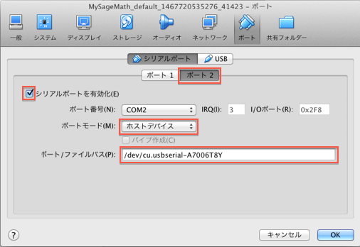

# Arduinoで電子工作を楽しもう
このページではNAT(ネットワーク・アシスト・たかおか)のArduino勉強会や私の趣味の電子工作を紹介します。

最初に、Vagrantの仮想マシンに起動したSageのjupyterでArduinoのスケッチを動かす方法をご紹介します。

## jupyterノートでArduinoのスケッチをうごかす
### Arduino開発環境の構築
最初にvagrantでArduinoの環境を利用できるようにします。

以下のパッケージを追加します。
- arduino: Arduino IDE
- picocom: シリアル通信プログラム
- ino: コマンドラインでArduinoのプログラミングをするツール

vagrantのMySageMathのインストールされているディレクトリに移動し、
以下のコマンドでSageサーバにパッケージをインストールします。
（$プロンプトのコマンドのみ入力してください）

``` bash
$ vagrant ssh
Welcome to Ubuntu 14.04.4 LTS (GNU/Linux 3.13.0-86-generic x86_64)
途中省略
vagrant:~$ sudo apt-get -y install arduino picocom
Reading package lists... Done
Building dependency tree       
インストール経過が出力されます。（途中省略）
0 upgraded, 0 newly installed, 0 to remove and 100 not upgraded.
#dialout groupにvagrantを追加し、シリアルデバイスを使用可能にします
vagrant:~$ usermod -aG dialout vagrant
#Sageのpythonにinoをインストールします。
vagrant:~$ sudo sage -sh
(sage-sh) root:~$ pip install ino
(sage-sh) root:~$ exit
vagrant:~$ exit
$ 
```

### VirtualBoxでシリアルポートの設定
最初にホストマシンにArduinoを接続したときに使用されるポートを調べます。
ホストのArduino IDEを起動し、「ツール」→「ポート」でシリアルポートのデバイス名が分かります。

これをメモしてください（私の場合「/dev/cu.usbserial-A7006T8Y」でした）。

次にVirtualBoxのゲストマシンでホストのシリアルポートが使えるようにOracle VM VirtualBoxマネージャ
でMySageMathの設定を変更します。

「ポート」アイコンをクリックし、「シリアルポート」タグを選択します。
ポート１とポート２の2個のシリアルポートが使えますが、
Ubuntuではシリアルポート１をコンソールとして使用しているため、シリアルポート２を使用します。

以下の図を参考に以下の項目をセットしてください。
- ポート２タブを選択
- 「シリアルポートを有効化」にチェック
- 「ポートモード」で「ホストデバイス」を選択
- 「ポート/ファイルパス」にメモしたデバイス名を入力



最後にvagrant upでSageサーバを起動してください。

## HelloWorldに挑戦
準備が整ったので、新しいjupyterノートを作成して、最初のスケッチを作成してみましょう。

組み込みの世界のHelloWorldといったらLEDを点滅させるLチカです。
以下のノートに従ってLチカに挑戦してください。

- [HelloWorld](HelloWorld.ipynb)