## こどもプログラミング教室（Web第１版）
このページは、須坂市技術情報センター&名古屋大学安田・遠藤研究室が公開された「こどもプログラミング教室」をベースに作成しています。


## Arduinoって何？

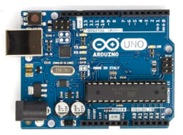

### Arduinoとは？
ArduinoはArduinoボード(ハードウェア)とArduino WebEditor(ソフト ウェア)の2つの要素から成り立っています。 Arduinoボードは、オープンソースハードウェアの考えに基いて 開発されたマイコンボードです。回路図などが公開されており、 それらの情報は誰もが自由に利用することができます。類似製品 を開発したり販売することも可能です。

Arduino WebEditorは、 ブラウザーからArduinoボードにプログラムを書き込むためのソフトウェア環境 です。

※Arduinoを使う時は金属板など電気を通すものの上に置かないように 気をつけましょう。裏側でショートして破損することがあります。 ※小さい部品は無くさないように気をつけましょう。踏んだりすると怪 我をすることがあります 。

### 用意するもの
- Arduinoボード 
- パソコン 
- USBケーブル(A-Bタイプ)

### Arduinoで出来ること
ArduinoボードにLEDやスイッチ、スピーカーなどの電子部品 を接続し、プログラムを組み込むことでLEDを光らせたり、 ON/OFFの制御をしたり、音を鳴らしたりと様々なことが可 能です。では、Arduinoをはじめてみましょう!

## Arduino WebEditorの環境構築
Arduino WebEditorを使えば、Webブラウザ上Arduinoのプログラミングができるようになります。

それでは、Arduino WebEditorが使える環境を整えていきましょう。

### ユーザ登録
Arduinoのホームページにアクセスします（以下のURLにアクセスすると以下の画面が表示されます）。
- https://create.arduino.cc/


「Arduino Web Editor」をクリックすると以下のユーザ登録（Sign Up）画面が表示されます。


- Username: 自分の好きなユーザ名（アルファベットと半角数字）で入力
- Password: パスワードを入力
- Confirm Password: 確認のために同じパスワードを入力
- Email Address: メールアドレスを入力
- I'm not a robotの左の□にチェック
- 「CREATE ACCOUNT」をクリックします

入力したメールアドレスに送られてきますので、リンク（URLアドレス）をクリックして登録を有効にします。


### Arduino Web Editor pluginのインストール
ユーザ登録が完了したら、以下のURLに入ってください。
- https://create.arduino.cc/editor

利用条件を受け入れ（Accept）ます。

次にスケッチをArduinoに書き込むために、Arduino Web Editor Pluginをインストールし、パソコンを再起動してください。


## Arduino Web Editorの画面
ログインが完了すると以下のArduino Web Editor画面が表示されます。

左端のカラムはナビゲーション用です。
- Your Sketchbook: ユーザが作成したスケッチブックを開きます
- Examples: サンプルスケッチ（読み込み専用）を開きます
- Libraries: スケッチ含むライブラリを指定します
- Serial monitor: シリアルモニタを開きます
- Help: ヘルプ画面（英語）
- Preferences: オプション（文字サイズ、色等）の設定画面

上記のメニューを選択すると2列目のカラムに選択画面が表示されます。

第3列目にスケッチを描く画面が表示されます。


## はじめの設定
Arduino WebEditorがインストールできたら、Arduinoボードとパソ コンをUSBケーブルでつなぎ準備をしましょう。ここでの作 業はArduinoを使う前に毎回行います。

- ArduinoボードとパソコンをUSBケーブルで繋ぎます。
- Arduino WebEditorにログインします。
- マイコンボードを選択します。
-- Select Other Board & Portを選択し、Arduino/Genuino Unoを選択します。
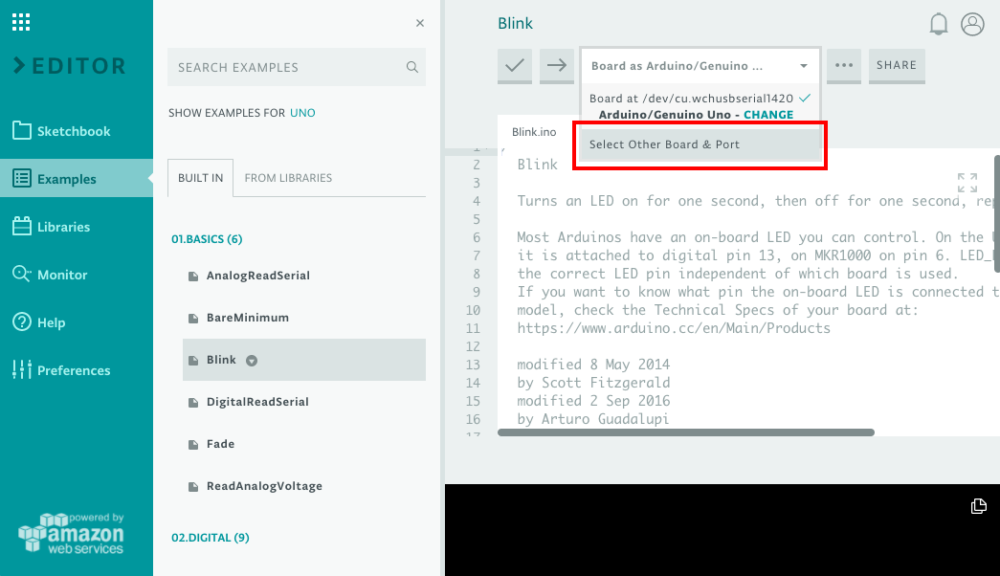
- シリアルポートを設定します。
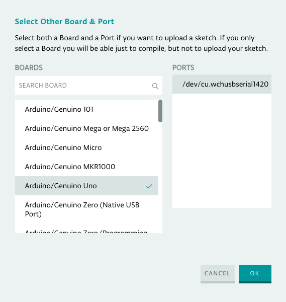
- これでArduinoの設定ができました。この作業は毎回行い ます。


## プログラムを実行してみよう【基礎編】
### LEDとは?
LED(Light Emitting Diode)は発光ダイオードといって電気を 流すことで光を出す素子です。リード線の⻑い方をanode(ア ノード)[陽極(+)]、短い方をcathodeカソード)[陰極(−)]と呼 びます。

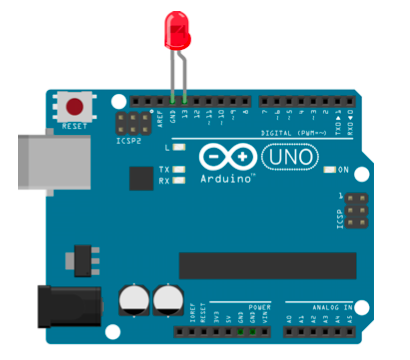

### 用意するもの
- Arduino開発環境一式

### 手順
- はじめの設定を行います。
- Examples→01. Basics→Blinkを選択します。
-  左上の➡︎ボタンをクリックするとプログラムコード がArduinoボードに書き込まれます。
-  LEDが点滅していれば成功です。

### 補足
Arduinoボード上には13番ピンに最初からLEDが接続されて
います。

### スケッチ

```python
%%HTML
<iframe src="https://create.arduino.cc/editor/takepwave/66734154-6cce-4de7-96a1-1202ac1f8d29/preview?embed" style="height:510px;width:100%;margin:10px 0" frameborder="0"></iframe>
```

## プログラムを実行してみよう【発展編】
### プログラムを修正して実行してみよう
基礎編のプログラムコードの数字の部分(赤字部分)を変える とLEDの点滅の仕方はどうなるでしょうか?

数字を大きくしたり、小さくしたりしてみましょう。

### 用意するもの
- Arduino開発環境一式 
- LED × 1

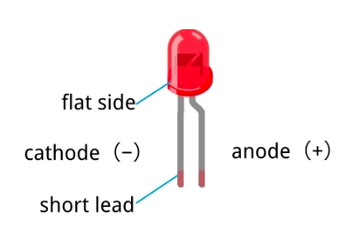

### 手順
- LEDの足の⻑いほうを13番に、短いほうをGNDに接続 します。
- 基礎編のArduino WebEditorの画面でled = 13の数字を書き換 えたらUploadボタンをクリックします。
- 点滅の仕方を確認して必要に応じて変えてみましょう。

### 発展編
LEDの場所を変えても点滅できるように、プログラムを修 正してみましょう。 

足の短い方はそのままで、⻑い方を12番や11番につなぎま す。

プログラムの修正部分は緑色で書かれている部分です。

## LEDとスイッチ
### タクトスイッチとは？
タクトスイッチは上部にバネ式のボタンがあり、下部には４つのリード線があります。
上部のボタンを押すことで、この４つのリード線の接続状態が変化します。

### 用意するもの
- Arduino開発環境一式
- LED × 1
- ブレッドボード × 1
- ジャンパーワイヤ（オス・オス）
- タクトスイッチ × 1
- 10KΩの抵抗(茶黒橙) × 1

### 手順
- 図を参考に配置します。
- はじめの設定を行います。
- プログラムコードを入力し、実行します。
- スイッチを押した時に、LEDが光れば成功です。

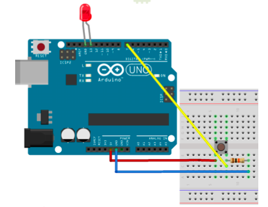

### 発展編
ボタンを押した時の光り方を変更させてみましょう。
プログラムコード中の「HIGH」と「LOW」を入れ替えてみてください。

### スケッチ

```python
%%HTML
<iframe src="https://create.arduino.cc/editor/takepwave/c354e979-8ea8-4cf2-a8c9-e7ae6759b464/preview?embed" style="height:510px;width:100%;margin:10px 0" frameborder="0"></iframe>
```

## ブザー
### 圧電スピーカーとは？
圧電振動板と呼ばれる圧電セラミックスと金属板を接着したものが入っています（図１）。
圧電振動板に電圧がかかると圧電セラミックスが伸び、接着されている金属板は伸縮せず曲がります（図２）。
圧電の向きが交互に変わる信号を入力することで、音波を発生させています。

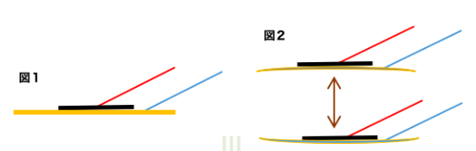

### 手順
- 図を参考に配置します。
- はじめの設定を行います。
- プログラムコードを入力し、実行します。
- ブザーが鳴れば成功です。

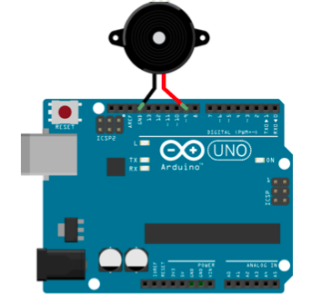

### 発展編
- ブザーの鳴る音を変化させてみましょう。
- プログラムコードのanalogWrite(9, 255/2);の255/2の数字を変化させることで音程を変えることができます。

```python
%%HTML
<iframe src="https://create.arduino.cc/editor/takepwave/8b5b655b-28dc-4e74-9285-191ba1a8645d/preview?embed" style="height:510px;width:100%;margin:10px 0" frameborder="0"></iframe>
```

## ブザーを使った音楽
### ブザーを使ってメロディーを鳴らしてみよう
ブザーで勉強したことをもとに、音階のメロディーを鳴らしてみましょう。

### 用意するもの
- Arduino開発環境一式
- 圧電スピーカー × 1

### 手順
- 図を参考に配置します。
- はじめの設定を行います。
- プログラムコードを入力し、実行します。
- 「ドレミファソ」とメロディーが鳴れば成功です。


### 発展編
数値を変更することで音階を変更することができます。

ラ： ４４０、シ： ４９４、ド: 523

８つの音階のみで演奏できる曲は意外とたくさんあるので、ネットなどで探してみてください。

```python
%%HTML
<iframe src="https://create.arduino.cc/editor/takepwave/e7aad2ed-873e-4043-965e-ffd4ae59024e/preview?embed" style="height:510px;width:100%;margin:10px 0" frameborder="0"></iframe>
```

## ブザーとスイッチ
### ブザーとスイッチについて
スイッチを押すとブザーが鳴るようにしてみましょう。

### 用意するもの
- Arduino開発環境一式
- 圧電スピーカー × 1
- タクトスイッチ × 1
- ブレッドボード × 1
- ジャンパーワイヤ（オス・オス）
- 10KΩの抵抗(茶黒橙) × 1

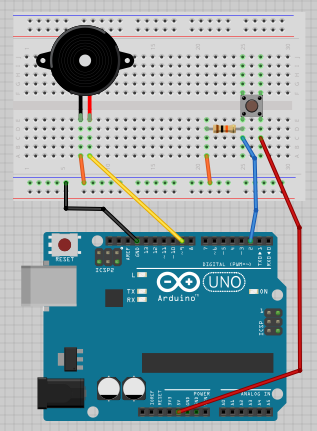


### 手順
- 図を参考に配置します。
- はじめの設定を行います。
- プログラムコードを入力し、実行します。
- スイッチを押した時にブザーが鳴れば成功です。


```python
%%HTML
<iframe src="https://create.arduino.cc/editor/takepwave/50c2ca07-11cd-4e68-9cdc-2fd61e8b5e87/preview?embed" style="height:510px;width:100%;margin:10px 0" frameborder="0"></iframe>
```

## Cdsセル（光センサ）

### Cdsセルとは？
Cdsセルは光に反応するスイッチです。受光する量によって抵抗値が変化し、明かるくなると抵抗値が小さくなり、
暗くなると抵抗値が大きくなります。

### 用意するもの
- Arduino開発環境一式
- ブレッドボード × 1
- ジャンパーワイヤ（オス・オス）
- LED × 1
- Cdsセル × 1
- 10KΩの抵抗(茶黒橙) × 1

### 手順
- 図を参考に配置します。
- はじめの設定を行います。
- プログラムコードを入力し、実行します。
- Cdsセルに手をかざしてLEDの光が変化すれば成功です。

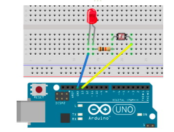

### 発展編
Cdsセルに当たる光の具合を変化させるために、プログラムコードのしきい値を変えてみましょう。


```python
%%HTML
<iframe src="https://create.arduino.cc/editor/takepwave/fd82fc2f-1ca6-48d7-b787-160cd9bde444/preview?embed" style="height:510px;width:100%;margin:10px 0" frameborder="0"></iframe>
```

## Cdsセルとブザー

### Cdsセルとブザー
手をかざすと音楽がなるようにしてみましょう。

### 用意するもの
- Arduino開発環境一式
- ブレッドボード × 1
- Cdsセル × 1
- 圧電スピーカー × 1
- ジャンパーワイヤ（オス・オス）
- 10KΩの抵抗(茶黒橙) × 1

### 手順
- 図を参考に配置します。
- はじめの設定を行います。
- プログラムコードを入力し、実行します。
- 光のあたり具合によってブザーの音程が変われば成功です。

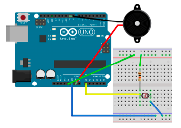

### 発展編
音が鳴る長さを変更してみましょう。

プログラムコード中の数宇「100」を「1000（１秒）」などに変更してみましょう。


```python
%%HTML
<iframe src="https://create.arduino.cc/editor/takepwave/71717059-bf94-46c0-9f61-9e5061e28826/preview?embed" style="height:510px;width:100%;margin:10px 0" frameborder="0"></iframe>
```
